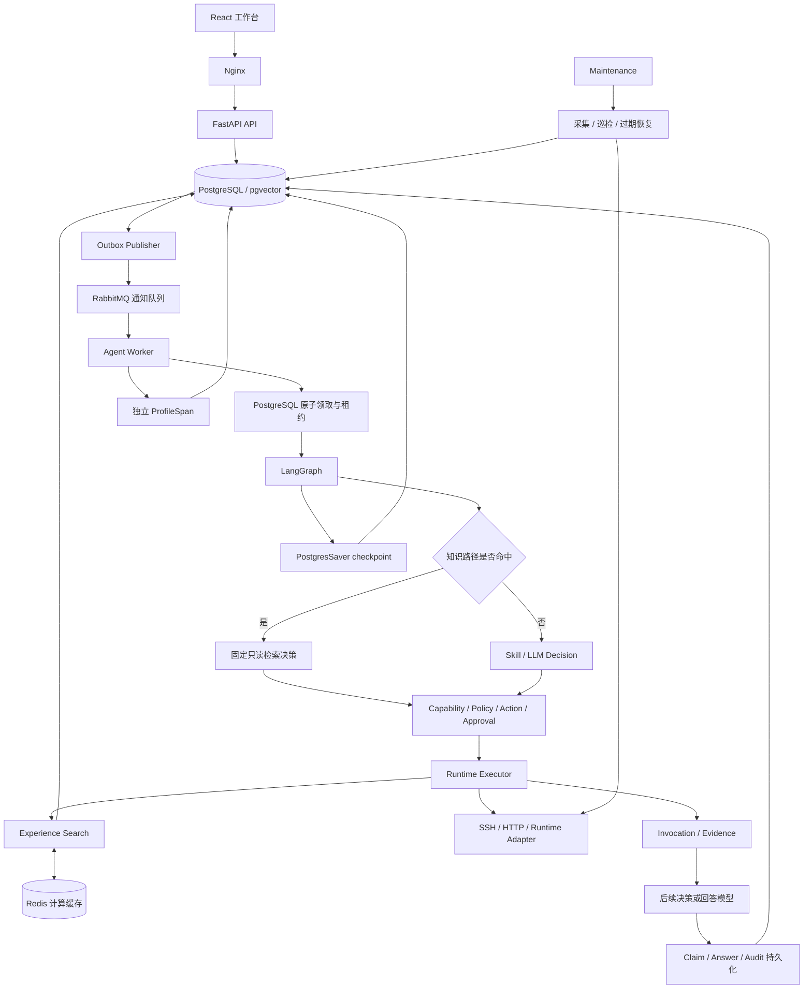
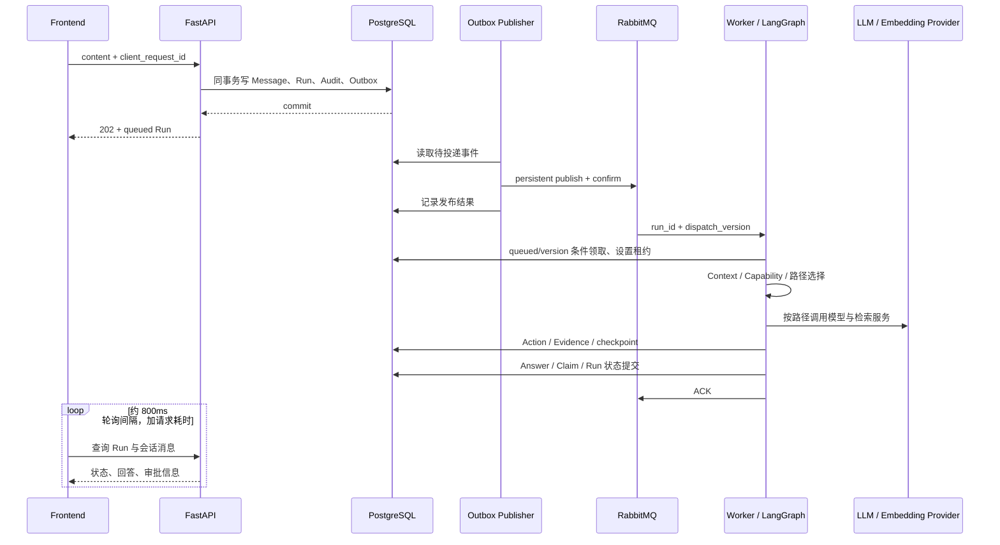
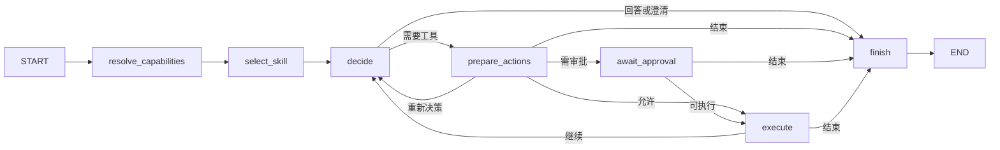
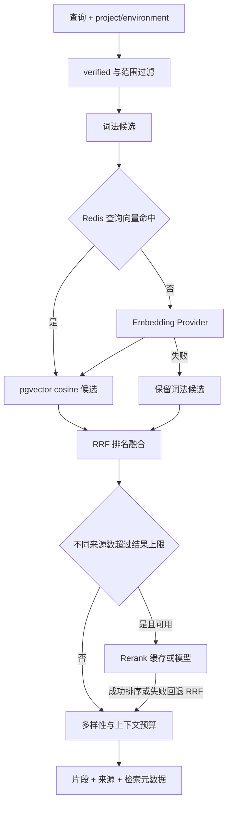

# Ops Agent Chat 详细设计

更新时间：2026-09-21。代码基线：`34ac2d1` 加当前工作区中的 Profiling、Redis、RabbitMQ、Knowledge Path 和系统知识更新。本文件描述当前实现，不代表这些改动已提交或形成独立发布版本。

本文采用“总分”结构：第一部分说明系统整体、关键链路与设计约束；第二部分按子系统展开职责、实现、数据与失败处理；第三部分给出部署、验证和演进边界。README 保留项目入口和快速开始，本文作为当前详细设计的主入口。

代码、数据库迁移和运行配置是行为依据；文档记录这些实现及其取舍。实验数据是特定日期和样本的结果，不是持续有效的性能承诺。修改系统行为时应同步更新本文对应章节，并保留原始实验报告。

## 阅读导航

| 层次 | 内容 |
| --- | --- |
| 总体 | [1. 系统定位](#s1)、[2. 总体架构](#s2)、[3. 请求链路](#s3)、[4. 设计约束](#s4) |
| 执行与治理 | [5. AgentRun 与 LangGraph](#s5)、[6. 消息投递](#s6)、[7. 模型与 Skill](#s7)、[8. 安全执行](#s8) |
| 知识与数据 | [9. Context 与采集](#s9)、[10. RAG](#s10)、[11. Redis](#s11)、[12. 证据与审计](#s12)、[13. 数据模型](#s13) |
| 产品与观测 | [14. 账号、API 与前端](#s14)、[15. 主动巡检](#s15)、[16. Profiling](#s16) |
| 运行与演进 | [17. 部署与配置](#s17)、[18. 故障处理](#s18)、[19. 验证与性能](#s19)、[20. 当前边界与维护](#s20) |

## 第一部分：总体设计

<a id="s1"></a>

### 1. 系统定位

Ops Agent Chat 面向个人开发者和小团队，通过对话完成项目知识问答、实时只读调查和受治理的运行状态变更。系统采用模块化单 Agent 架构：模型负责理解与生成结构化决策，确定性服务端模块负责授权、参数解析、审批、执行和结果验证。

不同问题需要不同证据。项目文档可以解释配置和排障方法，但不能证明服务现在健康；成功执行命令也不能证明故障已经恢复。设计围绕“请求范围明确、执行可控、事实有来源、异常不重复执行”展开。

| 问题类型 | 当前处理方式 | 结果依据 |
| --- | --- | --- |
| 无项目通用聊天 | 紧凑回答 Schema，可检索系统内置知识 | 常识与产品使用说明，不声称检查实际服务 |
| 明确的项目历史经验、文档查询 | Knowledge Path，一次固定检索后生成答案 | 本次检索到的 verified 项目文档与经验 |
| 实时状态、复杂只读诊断 | 原 Skill / Decision / Tool Loop | 实时工具证据，必要时结合 Context 和经验 |
| 重启、启停、扩缩容、登记变更 | 原 Agent Loop 与完整治理链 | 审批、执行、验证及恢复证据 |
| 主动巡检 | 确定性检查，异常可入队只读诊断 Run | 环境最新观察与事件记录 |

本轮没有完整实现四套独立的 Fast / Read / Diagnosis / Safe 图，也没有将全部工具调用并行化。Knowledge Path 是现有 LangGraph 节点内的一条收窄路径；其余请求沿用原图。

<a id="s2"></a>

### 2. 总体架构



图中表示职责与数据流，不表示所有模块处于同一事务，也不表示无项目聊天必须经过工具链。真实 LangGraph 拓扑见第 5 节。

| Compose 服务 | 主要职责 | 持久化与外部访问 |
| --- | --- | --- |
| `frontend` | React 静态资源、Nginx API 代理 | 默认宿主机端口 5175 |
| `backend` | 鉴权、资源管理、创建 Run、审批和查询 | 默认 `127.0.0.1:8000` |
| `worker` | 消费通知、领取 Run、运行图与工具 | PostgreSQL 租约，默认一个消费者 |
| `outbox` | 发布已提交事件、失败退避和排队补通知 | 查询 PostgreSQL，连接 RabbitMQ |
| `maintenance` | Collector、巡检、审批过期、租约恢复 | 独立于交互对话执行 |
| `postgres` | 权限、业务状态、知识索引、证据、审计、checkpoint | pgvector PostgreSQL 16，命名卷，默认本机端口 5432 |
| `rabbitmq` | 持久化通知、重试和死信队列 | 4.1-management，命名卷，不映射宿主机端口 |
| `redis` | 查询向量和重排计算缓存 | 7.4-alpine，128 MB、LRU、不持久化、不映射端口 |

PostgreSQL 是业务状态权威来源。RabbitMQ 消息只说明某个 Run 的某个入队版本值得领取，不携带操作授权；Redis 丢失全部数据只会导致重新计算。

<a id="s3"></a>

### 3. 真实请求链路

#### 3.1 从发送到回答



API 创建事务成功并不意味着 Broker 已收到消息，也不意味着 Worker 已开始执行。Outbox 让提交成功后的任务在 Broker 恢复后仍可继续投递。任务结果提交与消息 ACK 不是分布式事务，重复通知通过数据库领取条件处理。

#### 3.2 知识路径

`create_run → enqueue_run → publish_next → process_message → claim_run → process_claimed_run → execute_run → resolve_capabilities → select_skill 中的 knowledge_route → decide 生成 experience.search → prepare_actions → execute → decide 调用 answer_knowledge → finish → _persist_result`。

路由命中时不调用 Skill Selection LLM，也不让模型决定是否搜索。检索依然经过原 Action / Policy / Executor；返回的片段压缩后交给一次专用回答模型。默认检索上限为 5 个片段。

#### 3.3 原调查与变更路径

`resolve_capabilities → select_skill → decide → prepare_actions → [await_approval] → execute → decide` 可以循环多轮；模型选择回答或澄清时进入 `finish`。执行前后仍有取消、定义绑定、配置修订、审批、预检、验证和所有权检查。

只读请求无需人工审批，但仍经过权限与执行参数校验。变更不是由模型写一段命令直接执行，而是由已注册能力及冻结的配置决定可执行操作。

<a id="s4"></a>

### 4. 关键设计约束

| 约束 | 当前落实位置 | 含义 |
| --- | --- | --- |
| 模型输出不等于授权 | Registry、Policy、Executor | 模型不能提升权限或定义新工具 |
| 路由只能收窄路径 | `agent/routing.py`、`graph.py` | Knowledge Path 只有经验检索能力 |
| 消息不是执行权 | `dispatch.py`、`claim_run` | 重复通知必须重新检查数据库状态和版本 |
| 审批绑定具体动作 | Action snapshot/hash、Approval | 批准不能替换目标、参数或配置 |
| 取消和未知结果不能被晚到结果覆盖 | Run/Action 条件更新、执行 token、租约恢复 | 不把不确定副作用自动重放 |
| 检索材料不能证明当前状态 | Prompt、Evidence 类型和来源 | 历史经验只作历史或方法依据 |
| 缓存不保存授权决策 | Redis key 与缓存内容范围 | 不缓存审批、实时证据和最终答案 |
| 观测不承担业务职责 | ProfileSpan 独立表和写入 | Profiling 丢失不回滚业务事务 |

以上是实现约束，不等同于分布式“恰好一次执行”保证。SSH 目标发生副作用而本地尚未记录时，系统只能保留不确定状态并阻止自动重放，不能凭消息去重证明远端没有执行。

## 第二部分：子系统详细设计

<a id="s5"></a>

### 5. AgentRun 与 LangGraph

代码入口：[Run 服务](../../backend/app/agent/service.py)、[图定义](../../backend/app/agent/graph.py)、[状态](../../backend/app/agent/state.py)、[状态转换](../../backend/app/agent/status.py)。

#### 5.1 创建与幂等

`create_run` 在同一业务事务中保存用户消息、queued Run、创建审计和版本化 Outbox。提供 `client_request_id` 时，使用用户、会话、请求 ID 组成的事务 advisory lock，并配合数据库唯一约束查重；重复请求返回已有 Run，不再次创建消息和通知。

初始上下文包含 Run、用户、会话、项目、环境、最新问题和最多 12 条此前会话消息。自动监控诊断不加载普通对话历史。运行控制字段包括 `execution_mode`、`read_only` 和 `monitor_event_id`。

#### 5.2 图节点



`resolve_capabilities` 依据当前项目成员资格、环境运行时和只读标志获取允许的能力。`select_skill` 先检查知识路径，否则选择兼容 Skill 并将工具收窄到交集。`decide` 执行模型或确定性知识决策；后续节点仍共享执行治理逻辑。

#### 5.3 Run 状态与恢复

| 状态 | 说明 | 常见后续状态 |
| --- | --- | --- |
| `created` | Schema 中保留；普通创建接口直接入 `queued` | `queued` |
| `queued` | 等待数据库领取 | `running` / `cancelled` |
| `running` | Worker 拥有租约并运行图 | `waiting_for_approval` / `completed` / `failed` / `cancelled` |
| `waiting_for_approval` | checkpoint 已中断，等待审批处理 | `queued` 恢复 / `cancelled` |
| `completed` / `failed` / `cancelled` | Run 终态 | 不通过通知自动重新运行 |

审批拒绝、失效或过期也可能把 Run 重新入队，以便原图完成收尾；“恢复”不意味着被拒绝的动作获准执行。Action 的 `execution_unknown` 是动作结果，不是 AgentRun 的一种状态。

领取使用 `FOR UPDATE SKIP LOCKED`，只接受 queued 且通知版本匹配的 Run。租约默认 30 秒，执行期间独立心跳约每 5 秒续期。过期恢复将 Run 置为失败、执行中动作标为 `execution_unknown`、取消未开始动作，不自动重放远端变更。

LangGraph 使用 `PostgresSaver`，`thread_id=run_id`。审批通过 `interrupt` 暂停，恢复使用 `Command(resume=...)`。checkpoint 存储图状态，AgentRun 存储业务状态；两者加上远端副作用不构成一个原子事务，因此故障时仍需要保守恢复策略。

#### 5.4 完成与取消

`_persist_result` 创建或更新该 Run 的 assistant message，写入 Claim、来源链接、审批信息和结束审计，提交 Run 状态并释放租约。审批暂停也保存可展示消息，恢复后可以更新同一条 assistant message。

取消接口通过条件更新记录终态，关闭待审批/待执行动作，将执行中动作标记为结果未知。模型和传输层检查取消状态；无法立即停止的外部调用可能仍然返回，但晚到结果不能覆盖取消状态。取消请求不是撤销已经发生的远端副作用。

<a id="s6"></a>

### 6. RabbitMQ 与事务 Outbox

代码入口：[投递协议](../../backend/app/dispatch.py)、[发布进程](../../backend/app/outbox_publisher.py)、[消费进程](../../backend/app/broker_worker.py)、[Outbox 模型](../../backend/app/models/outbox.py)。

#### 6.1 事件协议与事务边界

```json
{
  "event_id": "<outbox UUID>",
  "run_id": "<AgentRun UUID>",
  "dispatch_version": 1
}
```

消息不包含用户问题、模型密钥、SSH 参数、审批结论或执行命令。解析器验证字段集合、UUID、版本类型及消息大小；重试头也有类型与范围校验。

`enqueue_run` 对 queued Run 增加 `dispatch_version`，插入唯一的 `(run_id, dispatch_version)` 事件。创建 Run、审批恢复和 critical 诊断入队均调用该函数，事务回滚时版本与 Outbox 一起回滚。迁移为升级前仍 queued 的 Run 回填通知。

发布器选择到期且仍为当前 queued 版本的事件，锁定 Outbox 行并跳过被锁行。发布使用 durable queue、persistent message、mandatory 路由及 publisher confirm。确认后提交 `published_at`、尝试次数和下次检查时间。确认成功后进程崩溃仍可能产生重复通知，消费端必须幂等。

#### 6.2 队列与消费者

| 队列 | 用途 |
| --- | --- |
| `ops.agent-runs.v1` | 主通知队列 |
| `ops.agent-runs.v1.retry` | TTL 5 秒后死信转回主队列 |
| `ops.agent-runs.v1.dead` | 无效通知或达到重试上限的通知 |

消费者 `prefetch=1`，每个进程一个 Run 执行线程；Pika I/O 在线程外继续处理心跳。收到消息先查数据库，不直接相信消息中的执行资格。

| 数据库观察 | 消费动作 |
| --- | --- |
| queued，版本匹配，成功领取 | 运行或恢复图，完成处理后 ACK |
| queued，版本匹配，但行被锁等原因未领取 | 进入延迟重试 |
| 已 running、终态、版本过期或 Run 不存在 | ACK，不再次执行 |
| 无效消息 | 转入死信并 ACK |

临时处理错误经过延迟重试，单次通知最多重试 5 次后转死信。发布器仍会约每 60 秒补发“当前版本且仍 queued”的任务，因此死信通知不代表权威 Run 已永久失败。排障需同时检查 Run 状态、Outbox 和队列，不能只看死信数。

Broker 断开时，Worker 不在原执行线程仍运行的情况下启动另一条 Run。恢复连接后，旧通知的重新投递仍受数据库状态约束。业务失败通常会由原 Run 服务记录为 failed，而不是让 MQ 无限重试整个 Agent。

#### 6.3 默认并发范围

当前 Compose 是单节点 RabbitMQ、单个 Agent 消费者，没有 Broker 集群、优先级队列或租户配额。支持部署多个消费者不等于已经解决跨 Run 的变更互斥；Run 级 CAS 只能防止同一 Run 被重复领取，不能串行化两个 Run 对同一服务的操作。

Collector 仍从 PostgreSQL 领取，由 Maintenance 执行，并未迁移到 RabbitMQ。这样避免把本轮投递升级扩大为全部后台任务重构。

<a id="s7"></a>

### 7. LLM Gateway、Skill 与 Knowledge Router

代码入口：[Gateway](../../backend/app/llm/gateway.py)、[模型配置](../../backend/app/llm/configuration.py)、[响应 Schema](../../backend/app/llm/schemas.py)、[Skill Registry](../../backend/app/skills/registry.py)、[Knowledge Router](../../backend/app/agent/routing.py)。

#### 7.1 模型配置与调用类型

用户模型设置优先于部署默认配置。用户配置中未单独提供 Key 时可以使用部署 Key；Base URL 通过允许列表校验，用户 Key 加密保存。Embedding 使用独立部署配置，不自动采用用户聊天模型。

| 调用 | 输入重点 | 输出与用途 |
| --- | --- | --- |
| `select_skill` | 问题、紧凑环境、候选 Skill 描述 | 最多选择一个 Skill，也可不选择 |
| `decide` | 问题、历史、上下文、允许能力、已得证据 | respond / clarify / invoke_tools / propose_change |
| `answer_general` | 通用问题、历史、系统知识片段 | 简短答案与实际采用的系统知识 ID |
| `answer_knowledge` | 当前问题、压缩后的检索来源 | answer + 最多 5 个 ClaimDraft；提示默认不超过 3 条原子 Claim |
| Rerank | 查询与候选片段 | 结构化相关性评分与排序 |

主决策请求 JSON 输出并用 Pydantic 验证，结构错误存在一次修复调用路径；修复本身会增加时延。不要将这一修复机制泛化为所有 Gateway 方法都具备同样重试语义。SDK 内部重试包含在一次请求耗时内。

ModelCall 记录目的、供应商、模型、prompt version、输入输出 Token、耗时、状态、请求 Hash 和结构化响应。取消、超时和异常仍进入原有处理路径；线程取消不能保证远端模型立即停止生成或停止计费。

`KNOWLEDGE_ANSWER_MODEL` 默认空。只有同时配置的 `KNOWLEDGE_ANSWER_BASE_URL` 与用户最终解析的 endpoint 匹配时，才使用该知识回答模型覆盖；不切换 endpoint，也不自动引入新供应商。本轮实测没有开启覆盖。

#### 7.2 Skill 的职责

Skill 是版本化 SOP，来自 `skills/definitions/*/SKILL.md`，包含运行时范围、必需能力、允许能力和流程文本。Registry 启动时校验引用与定义完整性，并计算定义 Hash。

当前有 `runtime-diagnosis` 和 `controlled-service-change`。Skill 必须满足运行时与已有能力集合要求；选择后只做允许能力交集，不增加权限。监控诊断可以确定性使用只读诊断 Skill，知识路径跳过 Skill 模型。

#### 7.3 保守知识路由

路由仅在 interactive 模式、有 `experience.search` 能力且问题长度受限时考虑命中。规则寻找历史、经验、知识库、文档等明确标记，并排除已知实时、变更、诊断或歧义表达。显式否定分句单独处理，混合“不要删除，但要重启”仍进入原流程。

命中后记录 `plan_json.request_path=knowledge`，将状态设为只读并仅暴露 `experience.search`。第一次 decide 构造固定查询，第二次 decide 调用 `answer_knowledge`。图的审批、执行和持久化节点没有被另建的旁路取代。

知识回答当前不发送整段聊天历史，主要依据当前问题和本次片段。规则不是完整自然语言理解，可能漏掉能加速的问题，也可能误解复杂复合句；能力白名单限制其副作用，但无法保证语义路由总是正确。模糊追问、需要多查询补证据的问题仍是后续评测重点。

<a id="s8"></a>

### 8. Capability、Policy、Action 与 Runtime

代码入口：[能力定义](../../backend/app/capabilities/definitions/core.yml)、[Registry](../../backend/app/capabilities/registry.py)、[Policy](../../backend/app/policy/engine.py)、[Action Hash](../../backend/app/policy/action_hash.py)、[Executor](../../backend/app/runtime/executor.py)、[验证](../../backend/app/runtime/verification.py)、[审批 API](../../backend/app/api/approvals.py)。

#### 8.1 Capability 契约

能力定义包括 name、version、description、effect、risk_level、runtimes、permission、approval_mode、executor、arguments，以及关联 precheck/verifier/rollback。当前 effect 主要为 read/change，不存在已全面启用的 `parallel_safe` 元数据调度系统。

Registry 校验版本、参数 Schema 和关联能力，持久化能力版本 Hash，并拒绝同 name/version 下的定义静默漂移。参数校验拒绝未知字段、错误类型和超范围值；服务及登记配方名另有字符约束。

只读能力包括项目上下文、依赖/影响关系、项目经验、系统知识、服务列表/状态/日志/检查、主机资源及登记健康接口。变更能力包括服务启停/重启/扩缩容、登记部署、登记配置更新。模型不能发明新的 Shell 或任意部署配方。

#### 8.2 Policy 与当前权限粒度

Policy 检查项目和环境有效性、成员资格、能力权限、effect 一致性、运行时支持和目标服务登记情况。只读动作通过后允许执行；未知目标可要求澄清，平台禁止能力直接拒绝。production 策略禁止 `service.stop` 及缩容为 0；普通交互变更必须具备审批策略。

当前 `permissions_for_role` 对任何有效项目角色返回完整项目权限集合。成员资格是访问边界，尚未实现成员间细粒度操作权限差异；字段名为 viewer 不意味着当前代码真的提供只读成员角色。此限制不能通过架构图中的“RBAC”一词掩盖。

#### 8.3 动作冻结与审批恢复

Action 冻结能力绑定、参数、项目/环境/目标、Runtime、工作目录、连接配置、配置修订、Policy version、风险和审批模式，以及关联能力和恢复配方。Hash 绑定最终语义。

审批 API 校验 Run 正在等待、审批仍 pending 且未过期、请求提交的 Hash 与 Action 一致，再条件更新审批。重复决定不能重复消费。拒绝一个审批会关闭同批次其余待处理动作；全部审批处理后通过版本化 Outbox 恢复原 Run 收尾或执行。

恢复后重新核验能力定义、配置修订、权限、Policy、预检和审批有效性。执行通过 Action 条件更新与执行 token 领取，Approval 在实际领取执行时消费。仅修改前端按钮状态不能授予执行权。

#### 8.4 Runtime、验证与恢复

Executor 可以处理数据库 Context/Experience、系统知识、HTTP，以及 SSH 下的 Docker Compose、Kubernetes、systemd、Host 和登记操作。并非每次 Tool 都调用 SSH；RAG 同样经过 Executor 并生成 Evidence。

SSH 传输负责密钥引用、主机指纹、超时、取消检查和有界输出。固定能力构造结构化命令参数；登记配置更新限制目标路径和备份/恢复方式，不给模型自由写入任意文件的能力。

命令退出 0 只代表调用成功。变更还需运行绑定 verifier，通过真实状态解析和稳定窗口判断目标是否达到；默认配置最多 3 次尝试、要求连续 2 次满足，间隔 2 秒。无法解析或缺 verifier 时不能标记 verified。

验证失败后按已冻结的恢复策略处理，可能是反向能力、配置备份、登记部署恢复或 no-op。结果通过 `verified`、`verification_failed`、`rolled_back`、`rollback_failed`、`execution_unknown` 等状态区分。系统没有对任意远端操作都能撤销的通用事务保证。

<a id="s9"></a>

### 9. 项目 Context 与 Collector

代码入口：[Context 服务](../../backend/app/context/service.py)、[采集任务](../../backend/app/context/jobs.py)、[Collectors](../../backend/app/context/collectors/registry.py)。

Context 描述项目里“有哪些实体、如何关联、信息从哪里来”。主要数据是 ContextSource、ProjectEntity 和 ProjectRelationship，包含环境范围、来源 ID、置信度、验证时间和 active 标记。

Collector 适配 Manual、Compose、Kubernetes、systemd、Nginx 和项目文件等输入。采集不等同于模型自主调查；它是独立的结构化上下文更新任务。CollectorRun 在 PostgreSQL 中排队，按环境与 collector 限制同时活跃任务，维护独立租约、取消与失败收尾。

Context 查询和关系查询通过注册能力向 Agent 提供来源 ID。登记的依赖关系帮助定位范围，但记录的配置关系和上次采集结果不等于实时服务健康。要回答“现在是否正常”，仍需 Runtime Evidence。

<a id="s10"></a>

### 10. Experience Search 与 RAG

代码入口：[索引与检索](../../backend/app/experience/service.py)、[分块](../../backend/app/experience/chunking.py)、[Embedding](../../backend/app/embeddings/service.py)、[Rerank](../../backend/app/reranking/service.py)。

#### 10.1 索引与信任范围

ExperienceItem 保存项目、可选环境、标题、正文、标签、来源和 trust_status：draft / verified / rejected / archived。检索只读取 verified 条目，并限制项目范围；指定环境时允许全项目共享条目与该环境条目，未指定环境时只读取不绑定环境的条目。

Markdown 按标题和段落分块，默认正文块预算 1800 字符、长段切分重叠 160 字符。Chunk 保存稳定 key、内容 Hash、标题路径、来源引用和索引文本。增量索引只对新增、内容改变或缺失向量的块生成 Embedding，移除不再存在的块。

向量列为 pgvector `Vector(1536)`，当前配置也固定 1536 维。迁移中建立 cosine HNSW 索引；查询是否使用索引及其收益仍取决于语料与 PostgreSQL 执行计划，不能只因存在索引就承诺大规模性能。更换 Embedding 模型需要重新生成已有文档向量，维度相同也不代表向量空间兼容。

#### 10.2 查询流程



图按当前实现顺序绘制：词法、Embedding、向量目前顺序执行，未新增并行召回。

1. 提取英文标识词及中文二元词等，最多 24 个去重词项。
2. 词法查询结合 PostgreSQL `simple` 全文检索、ILIKE 匹配和标题/标题路径/正文相关性重排。
3. 查询向量先读 Redis，未命中则调用 Embedding；按 cosine distance 取向量候选。
4. 每路候选上限为 `max(limit * 4, RERANK_CANDIDATE_LIMIT)`；RRF 用 `1 / (60 + rank)` 累加排名分数，不直接混加不同量纲的相似度。
5. 取融合结果的前若干候选，仅当候选涉及的不同来源数大于返回上限且 Reranker 可用时重排。
6. 选取结果时限制每个来源的片段数和总正文预算，返回内容、item_id、chunk_key、来源、trust_status、各路排名/评分及检索状态。

向量配置缺失或调用失败时保留词法检索；Rerank 超时、结构错误或不可用时保留 RRF。数据库事务级错误仍可能需要上层回滚，不能把所有数据库失败都视为可在同一事务中继续的普通降级。

#### 10.3 两层上下文预算

| 层级 | 默认值 | 作用 |
| --- | ---: | --- |
| Rerank 候选数 | 20 | 限制重排输入 |
| 每来源最多片段数 | 2 | 避免单个文档占满结果 |
| RAG 正文预算 | 9000 字符 | 检索结果组装的软预算，首块可能超预算 |
| Knowledge Path 正文预算 | 6000 字符 | 回答前按 item/chunk 去重并裁剪正文 |
| Knowledge Path 返回上限 | 5 个片段 | 固定经验查询参数 |

6000 字符不等于 6000 Token，也不包含所有 Schema、标题、来源字段等模型输入。来源 ID、类型、引用与 trust_status 保留，以免压缩后丢失证据语义。

verified 表示来源经过确认，不证明内容描述的是实际历史事件。回答提示要求区分通用排障指南和明确事件记录；未检索到不能推导为整个知识库绝不存在。引用过滤只能阻止链接到未提供的 ID，不能形式化证明模型文本一定受来源支持。

#### 10.4 本轮升级范围

已升级：共享 Query Embedding / Rerank 缓存、保守知识路径、片段去重与紧凑回答、分阶段耗时观测。

沿用：Markdown 分块、词法查询、pgvector cosine、RRF、小来源集跳过重排、失败回退。

尚未实现：自动多查询扩展、完整 Adaptive RAG、语义答案缓存、质量驱动的动态 Top-K、大语料性能验收。一次有界检索减少时延，也可能减少复杂问题的召回覆盖面。

#### 10.5 系统内置知识与项目经验不同

[SystemKnowledgeRegistry](../../backend/app/system_knowledge/registry.py) 从仓库 YAML 加载八类产品与运维说明，按条目词法匹配，在 UI 聚合为分类文档。它不走项目经验的 pgvector/Rerank 流程，也不由用户在网页中修改。

无项目通用回答可先本地检索这些条目，再将采用的 ID 保存到消息来源。系统知识不能授权新能力、改变 Policy 或证明目标环境状态。仓库定义更新后需要重建运行该代码的应用镜像。

<a id="s11"></a>

### 11. Redis 缓存设计

代码入口：[共享缓存访问](../../backend/app/cache.py)，Embedding 和 Rerank 模块负责生成各自身份信息。

| 缓存 | 内容 | 隔离与失效依据 | 默认 TTL |
| --- | --- | --- | ---: |
| Query Embedding | 单个查询向量 | endpoint、model、维度、Key 指纹、项目、环境、精确查询 | 86400 秒 |
| Rerank | 候选文档 ID 与评分 | 项目、环境、供应商/模型、配置指纹、prompt version、规范化 query、chunk/content Hash | 300 秒 |

Redis key 使用 Hash，不直接含查询明文或原始凭据。Embedding 缓存读取校验维度和数值有效性，Rerank 校验结构、ID 与评分；不合法值作为未命中或回退处理。缓存返回值仍受检索的项目/环境过滤和原执行权限边界约束。

Rerank 保留原有有界进程内缓存作为 fallback。Query Embedding 共享缓存不改变文档索引的 `.embed` 行为，也不保存用户权限、审批结果、实时状态或最终答案。

连接/读取 socket 超时 150ms，外层 Future 等待上限 200ms，覆盖 DNS 在内的调用等待；线程调度意味着实际测量可略高于 200ms。每进程最多一个待完成缓存 I/O，不不断堆积后台任务；失败后约 5 秒直接回退。底层 DNS 不一定被取消，但调用者不继续等待它。

Compose Redis 128 MB、`allkeys-lru`、无 AOF/RDB。缓存被逐出、Redis 重启或不可用都允许正常计算继续。没有分布式 single-flight，多个消费者在同时未命中时仍可能重复计算；本轮未承诺缓存击穿治理。

<a id="s12"></a>

### 12. Evidence、Claim、Audit 与 Profile 的分工

代码入口：[证据持久化](../../backend/app/evidence/service.py)、[Claim 持久化](../../backend/app/agent/service.py)、[审计](../../backend/app/audit/service.py)。

| 对象 | 回答的问题 | 不能代替什么 |
| --- | --- | --- |
| AgentStep | Agent 走了哪些业务步骤 | 不代替完整性能时间线 |
| ToolInvocation | 一次实际调用何时执行、结果是什么 | 成功退出不等于目标恢复 |
| RuntimeEvidence | 这次调用观察到哪些数据 | 历史检索证据不等于实时观察 |
| EvidenceClaim / Link | 回答作了什么断言，链接哪些来源 | 关联存在不代表自动完成语义事实校验 |
| AuditEvent | 谁在何范围做了什么决定或操作 | 不承担通用 Profiling |
| ProfileSpan | 阶段耗时、状态和性能元数据 | 不作为审批或执行依据 |

Executor 的结果经过有界输出与敏感信息处理，再保存 Invocation 和 Evidence。Evidence 包含 Run、Action、Invocation、目标、状态、观察时间、可选 freshness 和结构化数据。

Claim 区分 fact / inference / recommendation / general_knowledge / gap。来源分别存 RuntimeEvidence、ContextSource、ExperienceItem 链接，不把它们混成任意字符串引用。数据库约束要求一个 Link 恰有一种来源，并按来源建立去重约束。

结果持久化只保留本次 Run 可用的证据与检索来源 ID；没有来源的 fact 会降为 inference 并限制置信度。这样避免附上不属于本次观察的 ID，但模型仍可能误述来源内容，质量评测不能省略。

Audit 采用追加式 Hash 链，当前版本可用多个父 Hash 合并旧分叉。追加过程使用事务 advisory lock 串行发现链头和写入；数据库触发器限制更新/删除，校验接口复算链接完整性。它不是外部签名账本，也不能抵抗拥有数据库全部管理权限的攻击者重建整个数据集。

<a id="s13"></a>

### 13. 主要数据模型与事务

模型定义集中在 [models](../../backend/app/models/__init__.py)，结构变更通过 [Alembic](../../backend/alembic/versions) 管理。

| 数据域 | 主要表 | 关系与关键约束 |
| --- | --- | --- |
| 账号 | users、user_sessions、user_llm_settings | 会话撤销、token_version、每用户模型配置 |
| 项目 | projects、project_members、environments、connections | 项目成员唯一、环境范围、默认环境约束 |
| 会话 | chat_sessions、chat_messages | 用户问题与 assistant 回答关联会话 |
| Agent | agent_runs、agent_steps、model_calls、agent_workers | 客户端请求唯一、步骤序号唯一、租约与心跳 |
| 投递 | agent_run_outbox | `(run_id, dispatch_version)` 唯一，尝试次数/下次投递 |
| 治理 | capability_versions、actions、policy_decisions、approvals | 能力版本唯一、不可变快照、审批绑定 Hash |
| 执行证据 | tool_invocations、runtime_evidence | Run → Action → Invocation → Evidence |
| 回答依据 | evidence_claims、evidence_claim_links | Message → Claim → 一种合法来源 |
| Context | context_sources、project_entities、project_relationships、collector_runs | 采集来源、实体/关系、任务活跃约束 |
| 项目经验 | experience_items、experience_chunks | 来源信任状态、稳定 chunk key、1536 维向量 |
| 巡检 | monitor_events | 环境异常、诊断 Run 与恢复状态 |
| 审计 | audit_events | 只追加 Hash 记录 |
| 性能 | agent_run_profile_spans | 按 run_id 查时间线与聚合 |
| 图状态 | checkpoints 及 LangGraph 辅助表 | PostgresSaver 管理，业务 Alembic 比对中排除 |

跨表一致性依赖明确的局部事务，而不是跨系统全局事务：

1. 用户消息、Run、创建审计、Outbox 同事务提交。
2. 审批决定、动作状态、Run 恢复入队、Outbox 同事务提交。
3. 领取 Run 先提交所有权，然后运行长时间模型和工具调用。
4. Answer、Claim、来源链接、Run 结果和结束审计在结果事务内提交。
5. RabbitMQ 发布确认/ACK、LangGraph checkpoint、远端执行和 Profile 写入有各自边界。

新增迁移 `a9d2e7f4b610` 创建 ProfileSpan，`b1e3f5a7c902` 添加 dispatch_version 与 Outbox。本轮没有将安全状态迁到 Redis，也没有删除原业务表。

<a id="s14"></a>

### 14. 账号、API 与前端

代码入口：[安全模块](../../backend/app/core/security.py)、[项目鉴权](../../backend/app/api/deps.py)、[API](../../backend/app/main.py)、[前端工作台](../../frontend/src/pages/WorkspacePage.tsx)、[HTTP Client](../../frontend/src/api/client.ts)。

#### 14.1 身份与范围

密码使用带盐 PBKDF2 摘要。JWT 包含过期时间、token_version 和登录会话信息；服务端检查用户有效性与会话撤销状态。普通登录 Token 放 sessionStorage，记住登录放 localStorage；账号可以撤销其他会话，修改密码使原登录失效。

项目接口检查 owner/member 资格；AgentRun 详情、步骤、证据、动作和 Profile 使用 Run 所有者鉴权。用户模型地址必须在部署允许列表内，Key 加密保存且不通过普通配置接口返回原文。SSH 私钥由 credential_ref 引用，不把原始密钥交给模型。

当前不是完整租户 RBAC 管理产品，细粒度成员权限、外部身份提供方和邮件密码找回尚未完成。Web 默认 HTTP，公网访问仍需额外 HTTPS 入口。

#### 14.2 主要接口契约

| 接口 | 用途 |
| --- | --- |
| `POST /api/chat-sessions/{id}/agent-runs` | 创建任务，返回 202 与 queued Run |
| `GET /api/agent-runs/{run_id}` | 运行状态、当前步骤与计划 |
| `POST /api/agent-runs/{run_id}/cancel` | 请求取消并关闭相关待执行动作 |
| `GET /api/agent-runs/{run_id}/steps` | 业务步骤 |
| `GET /api/agent-runs/{run_id}/actions` | 动作与冻结参数的公开视图 |
| `GET /api/agent-runs/{run_id}/evidence` | 本次工具证据 |
| `GET /api/agent-runs/{run_id}/profile` | 性能时间线与 Top 耗时 |
| `POST /api/approvals/{id}/approve`、`reject` | 单动作审批 |
| `POST /api/agent-runs/{run_id}/approvals/approve`、`reject` | 批量审批 |
| `/api/projects`、`/api/environments`、`/api/connections` | 项目与运行配置 |
| `/api/experience`、系统知识相关接口 | 项目资料与只读产品知识 |
| `/api/projects/{id}/monitor-events` | 巡检事件 |
| `/api/audit-events/verify` | 审计完整性校验 |

完整方法、参数与响应以运行中的 `/docs` 为准。旧 `/agent-runs/{id}/execute` 接口仅兼容返回排队状态，不允许 API 直接代替 Worker 执行。

#### 14.3 前端数据流

Nginx 使用带共享 zone 的动态 upstream，经 Docker DNS `127.0.0.11` 解析 `backend:8000`，有效缓存时间 5 秒。后端容器替换后会重新解析地址；`/api/` 路径、查询参数和 HTTP 方法保留。此机制依赖当前 Nginx 1.27 镜像支持的 `resolve`，后端替换期间仍可能短暂失败，不构成零停机承诺。

工作台选择项目、环境和会话，提交消息后轮询 Run，并刷新消息与活动。Run 等待审批时展示 Action 目标、风险与影响；用户提交绑定 Hash 的决定，随后继续观察恢复结果。

`waitForRun` 在每轮网络查询和会话刷新后等待约 800ms，观察窗口约 5 分钟。超出窗口不等于取消后台任务。活动、采集和巡检还有各自刷新周期，因此 UI 可见时间不能简单等于后端耗时加固定 800ms。

本轮没有改成 SSE/WebSocket，也没有实现逐 Token 答案流。来源区能展示系统知识条目和证据数量，更多细节通过活动与证据接口获取；Profile 当前主要是查询接口，并非完整前端 APM 面板。

<a id="s15"></a>

### 15. 主动巡检与有限自动修复

代码入口：[监控服务](../../backend/app/monitoring/service.py)、[诊断入队](../../backend/app/monitoring/diagnostics.py)、[Maintenance](../../backend/app/maintenance.py)。

Maintenance 复用原 Worker 的维护循环，但不领取普通 AgentRun。它按环境扫描到期巡检，执行结构化 service.list，识别服务停止、不健康、缺失或连接失败等事件。同一环境/目标持续异常更新已有事件，观察恢复后标记事件解决。

巡检本身走确定性流程，也记录运行与动作证据，不必先等待一次 LLM 规划。critical 事件可创建 `monitor_diagnosis` Run，经 Outbox/RabbitMQ 由 Agent Worker 做只读诊断；该模式不走知识快速路径，也不授予变更权限。

自动修复与巡检是两个独立开关。当前只在 development/test、已启用授权、Docker Compose 登记服务明确停止并通过新鲜预检等窄条件下自动 `service.start`，然后验证。production/staging、不健康而非停止、服务缺失、Kubernetes/systemd 变更等不会因普通巡检直接获得自动修复资格。

这是环境 owner 的有限持续授权，不是全面取消审批。诊断提出的修复建议仍需用户重新发起并通过原治理链。系统暂未提供独立于自身的短信、邮件或 IM 告警。

<a id="s16"></a>

### 16. AgentRun Profiling

代码入口：[Profiling](../../backend/app/profiling.py)、[ProfileSpan](../../backend/app/models/profiling.py)、[接口](../../backend/app/api/agent_runs.py)。详细计时约定见 [Profiling 专项说明](../implementation/06-agentrun-profiling.md)。

#### 16.1 数据与阶段

每条阶段记录包含 `id`、`run_id`、`stage`、UTC `started_at/ended_at`、`latency_ms`、`status`、可选 `round_index` 和 `metadata_json`。模型请求尽量记录返回 Token usage，RAG 记录候选/结果数量、cache hit、跳过和失败原因。

| 阶段 | 边界 |
| --- | --- |
| `queue.wait` | 入队提交标记到成功领取标记，报告时配对计算 |
| `context.initialize` | 组装初始 Run 状态与历史 |
| `capabilities.resolve` / `skill.selection` | 能力解析与路径/Skill 选择 |
| `llm.decision` | 一轮决策节点，可能是确定性知识决策 |
| `llm.request` | 实际模型 SDK 调用，含其内部重试 |
| `tool.execute` | 一个能力执行，包含检索等内部工作 |
| `rag.search` | 整次项目经验检索 |
| `rag.embedding` / `embedding.cache` / `embedding.request` | 向量准备、缓存、实际向量请求 |
| `rag.lexical` / `rag.vector` / `rag.rrf` | 分路召回和融合 |
| `rag.rerank` / `rag.result_assembly` | 重排资格/实际重排、结果组装 |
| `answer.persist` | 回答、Claim、Run 等结果持久化函数 |
| `run.total` | Run 创建到最终回答提交，包含审批等待 |

当前 worker claim 用领取时间点记录，没有单独精确拆分锁等待和领取事务成本。Evidence、checkpoint、Audit、rollback 等开销可能包含在外层阶段或 Total 中，尚未全部独立细分。

#### 16.2 写入与查询

每个 Worker 执行片段通过 ContextVar 收集记录，局部耗时使用单调时钟；片段结束后用一次短生命周期数据库连接批量保存，不参与业务事务。入队标记在业务提交后另行保存。没有通用后台 writer 或分布式 parent-span 框架。

写入失败只记录警告；缓冲有界，硬退出、超时后台调用未结束或持久化失败可能留下缺口。接口返回 `recorded` 或 `partial_or_pending`，不能因为缺少 span 就认为某阶段耗时为 0。

接口提供按时间排列的 `timeline`、Top 10 耗时 `top_stages` 和按名称汇总 `stage_summary`。这些值包含重叠阶段，不能相加当成 Total，也没有精确 self-time 并集算法。

#### 16.3 时间口径

服务端 Total 截止到回答事务提交，不包含用户浏览器最终渲染。跨进程排队和人工审批间隔依赖 UTC；Worker 段通过单调时钟修正 Total，保留原始 UTC 差值与修正量。时钟跳变仍可能影响跨进程顺序和等待统计，部署需维护时间同步。

本轮未建设完整 APM，也未全面接入所有监控任务。需要先用当前粒度发现主要瓶颈，再决定是否细分 checkpoint 或 Audit 锁等待。

## 第三部分：部署、验证与演进

<a id="s17"></a>

### 17. 部署与配置

部署依据：[Compose](../../docker-compose.yml)、[环境示例](../../.env.example)、[Settings](../../backend/app/core/config.py)。所有命令在项目根目录执行，前提是 `.env` 已配置好，且本机 Docker 可用。

```bash
docker compose up -d --build
docker compose ps
curl -fsS http://127.0.0.1:8000/ready
```

Backend 入口执行 Alembic 迁移后启动 API，Compose 等待 Backend 健康后启动 Worker/Outbox/Maintenance。这里依赖 Compose 启动顺序，并没有新增可供任意多实例部署复用的分布式迁移锁。

`/live` 表示 API 进程存活；`/ready`、`/health` 检查数据库、checkpoint、Agent 和 Worker 心跳。RabbitMQ 模式仅接受 consumer 心跳，不以 Maintenance 心跳代替消费者可用。该接口不是每次对 RabbitMQ/Redis 的端到端探测，也不证明外部模型或 SSH 此刻一定可用。

| 配置 | 默认/重点 | 影响范围 |
| --- | --- | --- |
| `TASK_BROKER` | Compose 为 rabbitmq，直接 Settings 为 postgres | API 与 Worker 必须一致 |
| `RABBITMQ_URL` | 内网 AMQP 地址 | 与 Broker 初始化账号匹配 |
| `REDIS_URL` | Compose 为内网 Redis，直接 Settings 默认空 | 共享计算缓存 |
| `KNOWLEDGE_FAST_PATH_ENABLED` | true | 是否启用保守知识路径 |
| `KNOWLEDGE_CONTEXT_MAX_CHARS` | 6000 | 知识回答正文预算 |
| `KNOWLEDGE_ANSWER_MODEL/BASE_URL` | 默认空 | 指定 endpoint 的可选回答模型覆盖 |
| `LLM_TIMEOUT_SECONDS` | 90 | SDK 请求超时，Gateway 还有取消/等待逻辑 |
| `AGENT_TIMEOUT_SECONDS` | 300 | Agent 执行检查使用的时间限制，不是跨审批的严格整段 SLA |
| `AGENT_CONTEXT_MAX_CHARS` | 60000 | 原决策上下文预算 |
| `EMBEDDING_*` | 当前固定 1536 维 | 文档索引与查询向量 |
| `RERANK_*` / `RAG_*` | 候选、超时、缓存、来源多样性与预算 | 项目经验检索 |

RabbitMQ 账号变量初始化新数据卷，改变量不会自动轮换已有 Broker 凭据；特殊密码在 URL 中需编码。PostgreSQL 同样需要保持初始化密码与连接 URL 一致。

关闭快速路径可设置 `KNOWLEDGE_FAST_PATH_ENABLED=false` 后重建相关容器。直接运行应用时空 `REDIS_URL` 可禁用共享缓存；Compose 使用 `:-` 默认表达式，空 `.env` 值仍会回到内网 Redis，需要显式 Compose override 设置应用容器的空环境值。

回到 PostgreSQL 轮询模式时，先让运行中的操作结束，停止 Worker/Outbox/Maintenance，统一设置 `TASK_BROKER=postgres`，再启动 Backend/Worker；旧 Worker 自己执行维护工作，避免独立维护进程重复运行。保留新增 Schema 即可，无需破坏性降级。完整步骤见 [专项回退说明](../implementation/07-redis-rabbitmq-knowledge-path.md#configuration-and-rollback)。

PostgreSQL 保存账号、任务、知识与审计；RabbitMQ 卷保存队列；Redis 可重建。普通升级不能执行 `docker compose down -v`。备份与恢复必须覆盖数据库、部署配置、应用密钥和受控凭据存放位置，恢复后先确认是否存在远端已执行但本地未确认的动作。

#### 模型配置

后端使用 OpenAI-compatible 接口，部署默认模型由 `.env` 中的 `LLM_API_KEY`、`LLM_BASE_URL`、`LLM_PROVIDER`、`LLM_MODEL` 指定，不固定供应商。旧 `DEEPSEEK_API_KEY`、`DEEPSEEK_BASE_URL` 仍是兼容别名，新部署优先使用 `LLM_*`。用户模型设置、Endpoint 允许列表和凭据加密要求见 [LLM Gateway](#s7) 与 [账号和 API](#s14)，完整变量以 [环境示例](../../.env.example) 为准。

对话模型与 Embedding 独立配置：`EMBEDDING_API_KEY`、`EMBEDDING_BASE_URL`、`EMBEDDING_MODEL` 指定向量化接口，数据库当前要求 1536 维。未配置或调用失败时，项目检索可降级为词法检索。当前回答为非流式，模型调用的耗时和供应商返回的 token usage 可在 [Profiling](#s16) 中分析；模型输出仍须经过 Schema、Capability 和 Policy 校验。

#### 数据库与迁移

Compose 使用 `pgvector/pgvector:pg16`，项目已实现 pgvector 混合检索。`DATABASE_URL` 指向 PostgreSQL；容器内使用 `postgres` 服务名，宿主机连接应使用实际映射地址。账号和密码须与数据库已有数据卷一致。

```bash
docker compose up -d postgres
docker compose ps postgres
docker compose exec -T postgres sh -c 'psql -U "$POSTGRES_USER" -d "$POSTGRES_DB"' <<'SQL'
SELECT extname, extversion FROM pg_extension WHERE extname = 'vector';
SQL
```

Backend 启动时自动执行 `alembic upgrade head`。业务表由 [Alembic](../../backend/alembic/) 管理；`checkpoints`、`checkpoint_blobs`、`checkpoint_writes`、`checkpoint_migrations` 由 LangGraph checkpointer 管理，已从 Alembic 自动生成比较中排除。检查迁移版本可执行 `docker compose exec -T backend alembic current`。数据库备份和恢复还需保留应用加密密钥，否则恢复后的密文凭据无法正常使用。

<a id="s18"></a>

### 18. 故障处理矩阵

| 故障 | 当前行为 | 操作含义 |
| --- | --- | --- |
| Broker 提交时不可用 | Run/Outbox 提交成功后保持 queued，发布器重连 | 修复 Broker，不手动重放远端动作 |
| 发布确认后进程退出 | 可能重复投递 | Worker 按状态和版本去重 |
| 审批前的旧版本通知晚到 | 版本不匹配则 ACK | 不恢复旧执行阶段 |
| queued 行短暂锁冲突 | 延迟重试 | 不误当已执行而丢掉通知 |
| Worker 租约失效 | Run failed，执行中 Action unknown | 检查目标实际状态，不自动再执行 |
| Redis 超时、DNS 慢或损坏值 | 等待有界，正常计算或本地缓存回退 | 对话仍可继续，延迟可能增加 |
| Embedding 不可用 | 词法检索降级 | 召回质量可能下降 |
| Rerank 不可用 | 保留 RRF 顺序 | 保留检索结果而非中断问答 |
| 模型取消、超时、Schema 不合格 | 原 Gateway/图异常处理与 Run 收尾 | 不把不合法输出当授权动作 |
| 审批后配置/能力变更 | Hash、绑定、修订校验拒绝旧授权 | 重新生成可审核动作 |
| 验证未通过 | 不标 verified，按恢复配方处理 | 回答不能声称已恢复 |
| Profile 写入失败 | 业务保留，报告可能 partial | 不以观测完整性决定业务成功 |
| 前端轮询中断 | 后台任务可能继续并保存结果 | 重查会话，不盲目再次提交变更 |
| 前端 502、后端直连正常 | 核对 Nginx upstream 地址与 Docker DNS；动态解析避免长期缓存旧容器 IP | 同时验收前端代理 API，不能只查首页 |

Outbox 重试和死信不能替代运维监控；当前没有完整的 Outbox/DLQ 管理页面、长期保留清理策略或 Broker 高可用方案。大量历史 Profile、Outbox、Audit 的容量管理仍需随着使用规模补充。

<a id="s19"></a>

### 19. 已有验证与性能结论

证据来源：[基线](../../test-results/12-agentrun-profile-real.md)、[升级实验](../../test-results/13-v2-latency.md)、[完整 JSON](../../test-results/13-v2-experiments.json)。本节复述此前已执行结果，本次文档编写没有重新运行外部模型或故障实验。

| 同一历史知识问题，qwen-plus | 结果 |
| --- | --- |
| 原流程单次基线 | 53.163 秒，3 次 LLM，LLM 占 94.7% |
| 升级后的三次样本 | 13.147 / 11.841 / 11.932 秒 |
| 升级后中位数 | 11.932 秒，相比单次基线降低 77.6% |
| 最终回答输入 | 8219 Token 降到约 1960 Token |
| 最终回答输出 | 1496 Token 降到约 450 Token |
| 单次 RAG | 冷缓存 522ms，热缓存约 29–41ms |
| 剩余主要成本 | 回答 LLM 约 11 秒 |

收益主要来自减少两次模型调用和缩小回答上下文，不能全部归因于 Redis/RabbitMQ。三次是一个问题的小样本，不是 P95、吞吐测试或所有请求的 SLO。语料只有四个不同来源，因此样本跳过 Rerank，不能据此量化实际重排模型的加速。

真实实验覆盖 Broker 关闭后提交并恢复、已完成 Run 重复通知、Redis 停机回退、跨进程向量缓存命中。停 Redis 首次发现约 4 秒 DNS 等待，修复后缓存调用等待约 204ms；这属于实验发现并修正的实际问题。

此前全量后端结果为 226 passed、1 skipped；之后中文否定分句调整的 25 项专项测试通过。跳过的是显式开启的真实 Docker Runtime 变更矩阵；消息与缓存故障实验独立实际执行过。没有将这次文档更新描述成又一次全量测试。

| 验证主题 | 主要测试入口 |
| --- | --- |
| 消息、Outbox、缓存和 DNS 等待 | [test_v2_delivery_and_cache.py](../../backend/tests/test_v2_delivery_and_cache.py) |
| 知识路由、引用过滤、取消与受治理检索 | [test_knowledge_fast_path.py](../../backend/tests/test_knowledge_fast_path.py) |
| 阶段、写入故障和时间修正 | [test_profiling.py](../../backend/tests/test_profiling.py) |
| 图执行、审批与恢复 | [test_agent_graph_integration.py](../../backend/tests/test_agent_graph_integration.py) |
| 真实请求复现 | [benchmark_knowledge.py](../../backend/scripts/benchmark_knowledge.py)、[probe_delivery.py](../../backend/scripts/probe_delivery.py) |

已知验证限制：主机曾出现 UTC 跳变；一次 HTTP 轮询收到 401，根因未完全确定；`alembic check` 报告早期迁移的 `uq_claim_link` 和 `ix_experience_chunks_embedding_hnsw` 与 ORM 元数据有差异。本轮未删除约束/索引，也未放宽认证来掩盖问题。

<a id="s20"></a>

### 20. 当前边界与后续维护

| 当前状态 | 能力 |
| --- | --- |
| 已实现且有本地实测 | RabbitMQ/Outbox 投递、Redis 计算缓存、Knowledge Path、Run Profiling、真实知识查询端到端 |
| 已有代码与回归，仍需目标环境验收 | 多步诊断、审批变更、稳定窗口验证、恢复策略、Collector、主动巡检 |
| 不能当作已经完成 | 独立四级路由、通用并行工具调度、跨 Run 变更互斥、完整 Adaptive RAG、答案语义缓存 |
| 尚未产品化 | MQ 高可用和运维面板、细粒度成员授权、流式答案、外部告警、广泛模型质量评测 |

后续优化应继续按 Profile 分配工作：模型占优时验证更快的知识回答模型、上下文与输出设计；排队占优时评估安全并发；Rerank 占优时评估触发条件和缓存；数据库召回慢时再做执行计划和索引分析。不要将未测量的优化方向写成已上线能力。

扩展 Capability 时必须同时定义参数、范围、风险、审批、验证与恢复，并更新 Registry 和安全测试。扩展知识路由时需要加入正反例、混合意图、跨轮引用、无来源及错误来源的质量评测。更换缓存 Key、向量模型或检索预算时应重新验证隔离和召回质量。

本文维护约定：行为发生变化时更新对应子系统、调用链与状态表；配置变化同时核对 `.env.example` 和 Compose；性能结论保留日期、模型、样本量、口径和原始 Run；历史设计保留时间戳并指向本文件，不再冒充当前实现。

相关文档：[项目入口](../../README.md)、[文档索引](../README.md)、[Profiling 专项](../implementation/06-agentrun-profiling.md)、[消息与缓存升级专项](../implementation/07-redis-rabbitmq-knowledge-path.md)、[RAG 工程实验](../rag/RAG_ENGINEERING_DECISIONS_AND_EXPERIMENTS.md)。
