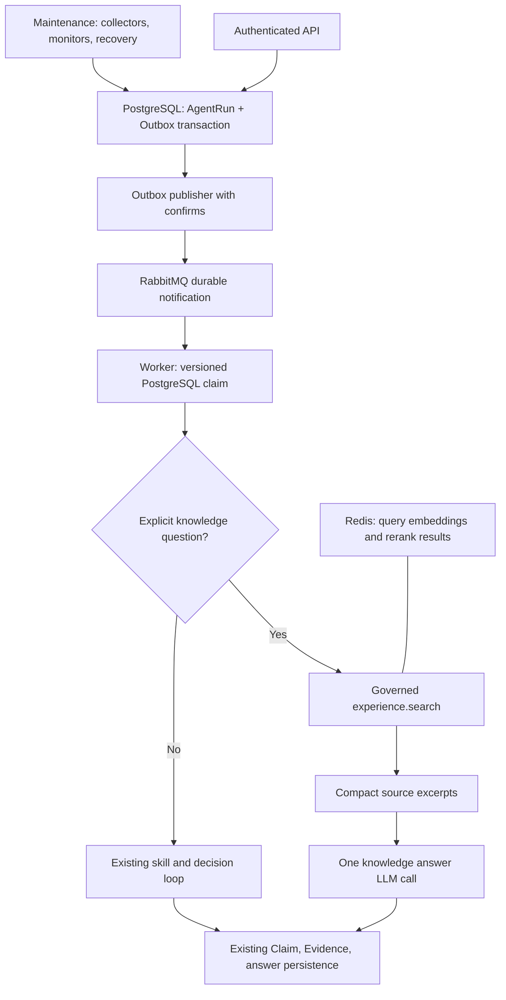

# Redis, RabbitMQ, and the Knowledge Path

## Scope

This upgrade addresses two separate costs: task dispatch/repeated computation and unnecessary
model decisions in explicit historical/documentation queries. Redis and RabbitMQ alone cannot
remove a 37-second answer-model call. The measured baseline spent 94.7% in three LLM calls.

The default Compose stack enables RabbitMQ delivery, Redis computation caches, and a conservative
knowledge path. The existing model configuration is retained. Live diagnosis, changes, ambiguous
requests, and monitoring diagnoses continue through the existing Agent graph behavior.



## Task Delivery

- `agent_runs.dispatch_version` identifies a particular enqueue/resume generation.
- `agent_run_outbox` stores one event per run/version in the same transaction that queues the run.
  Rolling back an approval resume also rolls back the notification. Client request replay does not
  create a second notification.
- A dedicated publisher reads committed rows with `FOR UPDATE SKIP LOCKED`, publishes persistent
  messages to a durable queue using mandatory delivery and publisher confirms, then records delivery.
  A crash between confirm and commit can duplicate a message, so workers must deduplicate.
- Notifications contain only `event_id`, `run_id`, and `dispatch_version`. PostgreSQL remains the
  authority for authorization, run ownership, leases, cancellation, approval, and execution state.
- Each worker uses prefetch 1 and one execution thread. RabbitMQ I/O remains active during model
  calls. A notification is acknowledged after processing reaches a durable outcome or is obsolete.
- A stale version, duplicate, terminal run, or running run is acknowledged without executing again.
  A locked but still queued row is retried. Transient delivery failures go through a 5-second retry
  queue, then a dead-letter queue after five retries. Malformed notifications go directly to dead letter.
- Every 60 seconds the outbox may re-notify a still-queued current version. This also reconciles missed
  notifications; a dead-letter notification does not cancel its authoritative queued run. Running,
  unknown, and terminal executions are never automatically replayed.
- The existing lease-expiry behavior remains: fail the run, mark uncertain actions unknown, and do
  not replay a potentially applied change. Broker recovery is not permission to retry side effects.

Queues: `ops.agent-runs.v1`, `ops.agent-runs.v1.retry`, `ops.agent-runs.v1.dead`.
RabbitMQ has a named volume. Its management and AMQP ports are internal to Compose.

The maintenance process runs the existing collector, monitoring, approval-expiry, and lease-recovery
jobs independently of conversation execution. It does not claim interactive AgentRuns.

## Cache Boundaries

Redis stores only recomputable data and uses a 128 MB `allkeys-lru` limit. Cache reads/writes use
150 ms socket timeouts and a 200 ms caller deadline including DNS. At most one cache I/O task can
remain pending per process, with no accumulating work queue; an error opens a five-second fallback
interval. This bound was added after a real stopped-container DNS lookup took four seconds. No persistence
is required for this Redis instance. Missing, expired, invalid, or inaccessible values trigger normal
computation. A Redis restart produces cold caches and must not fail a conversation.

Query embedding keys include project/environment, exact query, provider endpoint, model,
dimensions, and credential fingerprint. Only hashes appear in keys. Document indexing remains
unchanged. Embedding TTL defaults to 24 hours and can be disabled with TTL 0.

Rerank keys retain query/chunk/content identity and include provider/model/credential identity and
prompt version. Redis shares results across processes, with the previous bounded local cache as
fallback. The default TTL remains 300 seconds. Retrieval results, permissions, approvals, live
runtime evidence, final answers, and execution state are not cached.

## Knowledge Path and Evidence

Admission uses deterministic rules, existing capability availability, and interactive execution mode.
It requires an explicit history/experience/documentation intent and rejects recognized live, change,
diagnosis, and contextual ambiguity markers. This conservative router is not an authorization layer.
Unknown wording retains the original loop; the router is not a complete natural-language classifier.

An admitted run exposes only `experience.search`, sets read-only intent, skips the skill model,
and creates one fixed search call. The call still passes through existing argument validation,
capability/permission checks, Policy, Action/hash/token, Executor, Audit, and Evidence persistence.
It does not bypass execution by calling the retrieval service directly.

Retrieved excerpts are deduplicated and limited to 6,000 content characters. Evidence/item IDs,
title, source type/reference, and trust status are retained. The answer request uses a smaller schema
without planning/tool definitions and defaults to a concise response. Claims only retain citations
to supplied evidence/items. Documents are untrusted source data, never instructions; reviewed
troubleshooting guidance is explicitly distinguished from proof that a historical incident occurred.

Existing cancellation and execution deadline checks remain. Model errors use the original graph's
failure handling. This path cannot issue a change or inspect live runtime. There is no automatic
upgrade to a new four-path architecture or parallel execution of change tools in this revision.

Tradeoff: this is one bounded retrieval, not the original LLM's possible multi-query investigation.
Some questions can require broader recall or more history/context. The prompt must state evidence
gaps, and quality evaluation across more questions is still needed before expanding admission.

## Configuration and Rollback

| Setting | Compose default | Purpose |
| --- | --- | --- |
| `TASK_BROKER` | `rabbitmq` | `postgres` restores the legacy polling worker |
| `RABBITMQ_URL` | Internal local broker | Must match `RABBITMQ_USER` / `RABBITMQ_PASSWORD` |
| `REDIS_URL` | `redis://redis:6379/0` | An empty application environment value disables shared cache; see Compose override below |
| `EMBEDDING_CACHE_TTL_SECONDS` | `86400` | `0` disables query embedding cache |
| `KNOWLEDGE_FAST_PATH_ENABLED` | `true` | `false` restores normal skill/decision selection |
| `KNOWLEDGE_CONTEXT_MAX_CHARS` | `6000` | Content excerpt budget |
| `KNOWLEDGE_ANSWER_MODEL` | Empty | Optional answer-model override |
| `KNOWLEDGE_ANSWER_BASE_URL` | Empty | Override applies only to this exact configured endpoint |

No API credentials, user model settings, or frontend polling settings are changed by the upgrade.
For a clean deployment, use `.env.example`; for an existing deployment, omitted settings use the
defaults above. When changing RabbitMQ credentials, update the URL consistently. RabbitMQ default
user variables initialize a new volume; changing them does not rotate an existing broker account.

Build/start:

```sh
docker compose up -d --build
docker compose ps
curl -fsS http://127.0.0.1:8000/ready
```

Application entrypoints apply Alembic migrations. Compose starts the backend first and waits for
its health check before starting worker/outbox/maintenance, so its migration completes first.
Migration `b1e3f5a7c902` backfills notifications for already queued runs.

Disable only the fast path by setting `KNOWLEDGE_FAST_PATH_ENABLED=false` in `.env` and
recreating backend/worker/maintenance. For direct application startup, an empty `REDIS_URL` disables
shared caching. Compose uses `${REDIS_URL:-redis://redis:6379/0}`, so an empty `.env` value still
selects its default. To disable shared caching in Compose, use an override with an explicit empty
`environment.REDIS_URL` for backend/worker/outbox/maintenance and recreate those services.
For full legacy dispatch fallback, first let active operations finish, stop worker/outbox/maintenance,
set `TASK_BROKER=postgres`, then recreate backend/worker. Leave outbox and maintenance stopped
in legacy mode: the legacy worker performs those maintenance duties itself. Keep schema additions
in place; no data-destructive downgrade is necessary. Pending queued runs remain in PostgreSQL.

The default remains one conversation consumer. Replication is technically available after removing
the fixed worker container name, but enabling multiple consumers also permits different runs to
operate on one environment concurrently. This revision does not add cross-run mutation serialization,
so it does not enable a larger pool by default.

## Verification and Measurement

See [the experiment report](../../test-results/13-v2-latency.md) for actual before/after results,
run IDs, token counts, cache effects, and broker/cache outage experiments.

Reproduce the read-only conversation benchmark using the configured local admin credentials
(the script does not print them):

```sh
docker compose cp backend/scripts/benchmark_knowledge.py backend:/tmp/benchmark_knowledge.py
docker compose exec -T backend env PYTHONPATH=/app python /tmp/benchmark_knowledge.py --runs 3
docker compose cp backend:/tmp/ops-v2-benchmark.json /tmp/ops-v2-benchmark.json
```

`--question` accepts another explicit knowledge question. The probe creates new conversations and
makes real paid provider calls; results are saved as JSON with full profile timelines and answers.
`probe_delivery.py` provides explicit enqueue/wait/duplicate phases for controlled local fault tests.
Only run its enqueue assertion while the broker is deliberately stopped and no unrelated operations
are active; always restore services after the experiment.

Profile endpoint: `GET /api/agent-runs/{run_id}/profile`, using the run owner's existing authentication.
Nested stage durations overlap and must not be summed. The frontend still polls at approximately
800 ms; server completion, HTTP observation, and browser render latency are distinct metrics.
No SSE/WebSocket change is included.
