# Ops Agent Chat 源码深度教学

> 面向项目作者的代码导读。本文对应代码基线：
> `3c8c46c5b3d4ccaf99a85633328988513bf741ba`。
>
> 16 张图用于帮助建立心智模型；字段、状态和异常分支最终以当前源码为准。
>
> 本文是历史基线教学，尚未覆盖 Redis、RabbitMQ、独立 Maintenance、Profiling 和 Knowledge Path。最新总分结构设计见 [当前详细设计](../architecture/CURRENT_DESIGN.md)。

## 1. 这份文档怎么学

这不是一份部署手册，也不是把所有文件逐行翻译一遍。它重点回答四个问题：

1. 用户发出一句话后，代码到底经过了哪些模块？
2. LLM 为什么不能直接执行任意命令？
3. 一次变更为什么要经过 Action、Hash、Approval 和 Verification？
4. Worker、Evidence、Audit 和主动巡检分别解决什么工程问题？

建议按以下顺序学习：

1. 先读第 2～8 章，建立总体架构、账号和请求链路。
2. 再读第 9～13 章，理解 LangGraph、结构化 Decision 和 Capability。
3. 接着读第 14～26 章，理解审批安全、真实执行、证据、巡检和前端。
4. 最后用第 27～36 章的案例、练习和实现边界回到源码。

阅读时可以同时打开这些目录：

- [后端应用](../../backend/app/)
- [前端源码](../../frontend/src/)
- [Capability 定义](../../backend/app/capabilities/definitions/core.yml)
- [后端测试](../../backend/tests/)
- [Docker Compose](../../docker-compose.yml)

文中只在关键架构位置设置“面试重点”。这些问答不是背诵模板，而是帮助你把代码事实整理成面试时能讲清楚的语言。

## 2. 先记住这些核心对象

| 对象 | 大白话 | 主要保存位置 |
|---|---|---|
| `ChatSession` | 一次聊天会话 | PostgreSQL |
| `ChatMessage` | 用户或 Agent 的一条消息 | PostgreSQL |
| `AgentRun` | 后台处理一条用户消息的任务 | PostgreSQL |
| `AgentState` | LangGraph 节点之间传递的临时状态 | LangGraph checkpoint |
| `Capability` | Agent 被允许选择的语义能力 | YAML + Registry |
| `Action` | 一次已经解析好的具体工具操作 | PostgreSQL |
| `PolicyDecision` | Policy 对 Action 的允许、拒绝或审批判断 | PostgreSQL |
| `Approval` | 用户对某个确定 Action 的审批记录 | PostgreSQL |
| `ToolInvocation` | 一次真实工具调用记录 | PostgreSQL |
| `RuntimeEvidence` | 工具返回的实时证据 | PostgreSQL |
| `EvidenceClaim` | Agent 根据证据提出的事实、推断或建议 | PostgreSQL |
| `AuditEvent` | 谁在何时做了什么的可校验审计记录 | PostgreSQL |
| `MonitorEvent` | 主动巡检发现的异常或恢复事件 | PostgreSQL |

最重要的区别是：

```text
AgentRun = 整个任务
Action   = 任务中的一个具体操作
Approval = 用户是否允许某个 Action
Evidence = 操作观察到了什么
Claim    = Agent 根据证据说了什么
Audit    = 系统过程发生了什么
```

---

# 第一部分：系统全貌

## 3. 系统总体架构

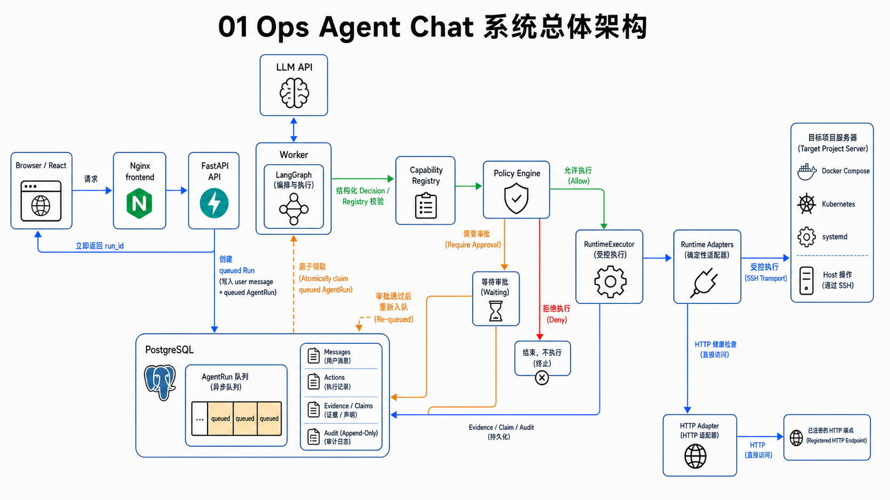

系统可以分成六层：

### 3.1 展示层

React 前端负责：

- 登录、注册和账号设置；
- 项目、环境和 SSH 连接配置；
- 聊天消息；
- Agent 活动步骤；
- 审批选择；
- 主动巡检事件；
- 经验和配置展示。

前端不直接连接目标服务器，也不直接持有 SSH 私钥。浏览器只调用 FastAPI。

### 3.2 API 层

FastAPI 负责：

- 身份认证；
- 项目和会话权限检查；
- 接收聊天消息；
- 创建 `AgentRun`；
- 查询运行状态；
- 接收审批；
- 管理项目、环境、连接和模型配置。

关键点是：**发送消息的 HTTP 请求只创建任务，不在请求线程里完成整套 Agent 执行。**

### 3.3 Agent 编排层

LangGraph 负责把一次任务组织成可恢复的状态机：

```text
解析可用能力
→ 模型决策
→ 准备 Action
→ 等待审批
→ 执行与验证
→ 再次决策或生成结果
```

### 3.4 治理层

治理层包含：

- Capability Registry：有哪些能力；
- Policy Engine：当前用户、项目和环境是否允许；
- Action Hash：审批内容和执行内容是否一致；
- Approval：高风险变更是否得到明确授权；
- Verification：执行后目标状态是否真的满足预期。

### 3.5 Runtime 层

Runtime Adapter 把语义能力翻译成确定性的执行方式，例如：

- Docker Compose；
- Kubernetes；
- systemd；
- Host；
- HTTP；
- 已登记部署或配置修改。

SSH Transport 只负责安全地把确定性命令发送到目标服务器。

### 3.6 数据与证据层

PostgreSQL 保存用户、项目、聊天、Run、Action、审批、证据和审计。LangGraph 的 checkpoint 也在 PostgreSQL 中。

这意味着系统部署在服务器上时，用户换浏览器或电脑登录，账号和聊天记录仍然属于服务端数据，而不是浏览器本地数据。

### 3.7 Project、Environment 和 Connection 的边界

这三个对象不是重复配置：

| 对象 | 负责什么 | 典型内容 |
|---|---|---|
| `Project` | 用户看到的业务项目和成员边界 | 名称、描述、owner、member |
| `Environment` | 同一项目的一套运行范围 | dev/prod、runtime、workdir、namespace、Policy、巡检开关 |
| `Connection` | 如何连接一台目标机器 | host、port、username、私钥引用、Host Key 指纹 |

一台服务器可以运行多个项目，系统不是仅凭 SSH 主机区分它们，而是继续使用
`Environment.workdir`、`namespace`、runtime 配置和已登记服务限定操作范围。同一个
`Connection` 可以被项目 owner 的多个环境引用，但环境只能引用所属项目 owner
拥有的 Connection。

当前权限模型保留了 owner/member 和权限接口，但项目成员暂时使用统一的完整项目权限。
这不等于“所有注册用户可以操作所有项目”：API 仍先检查用户是否是该项目 owner 或 member。

## 4. Docker 部署拓扑

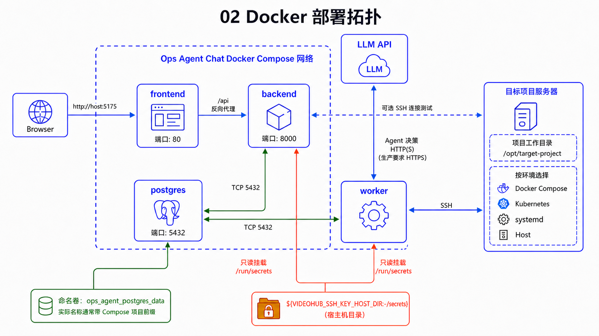

当前 [docker-compose.yml](../../docker-compose.yml) 启动四个核心服务：

| 服务 | 作用 |
|---|---|
| `postgres` | 业务数据、pgvector、LangGraph checkpoint |
| `backend` | FastAPI API |
| `worker` | 异步领取并执行 AgentRun、主动巡检 |
| `frontend` | Nginx 托管 React 静态资源并代理 `/api` |

`backend` 和 `worker` 都挂载：

```yaml
./docs:/app/docs:ro
${VIDEOHUB_SSH_KEY_HOST_DIR:-./secrets}:/run/secrets:ro
```

这里有两个重要结论：

1. SSH 私钥是部署者放入宿主机 `secrets/` 后，只读挂载进容器，不经过浏览器上传。
2. 仅修改数据库里的 `credential_ref` 不会自动生成私钥；它只是告诉系统去容器内哪个路径读取。

当前默认入口：

```text
浏览器 → http://服务器地址:5175
前端 Nginx → /api → backend:8000
backend/worker → PostgreSQL
worker → SSH → 目标服务器
```

运行 `docker compose down` 不会删除命名卷中的数据库；`docker compose down -v` 会删除卷，测试时要区分。

## 5. 项目目录与模块关系

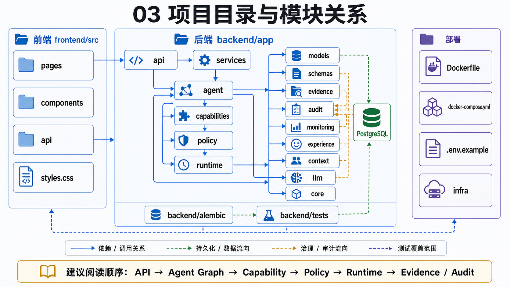

后端最值得优先阅读的目录如下：

```text
backend/app/
├── api/                 # FastAPI 路由
├── agent/               # AgentRun 服务和 LangGraph
├── capabilities/        # Capability Registry 与 YAML 定义
├── policy/              # 权限、风险、Action Hash
├── runtime/             # Adapter、Executor、SSH、验证
├── llm/                 # 模型网关与结构化输出
├── monitoring/          # 主动巡检和低风险自动修复
├── models/              # SQLAlchemy 数据模型
├── schemas/             # API Pydantic Schema
├── audit/               # append-only 审计 Hash DAG
├── context/             # 项目上下文采集
├── experience/          # 已验证历史经验
├── main.py              # FastAPI 入口
└── worker.py            # Worker 入口
```

不要把 `agent/graph.py` 理解成“全部 Agent”。它是编排中心，但真实职责分散在 Registry、Policy、Runtime、LLM、数据库模型和 Worker 中。

---

# 第二部分：从 HTTP 请求到 AgentRun

## 6. FastAPI 应用入口

后端入口是 [backend/app/main.py](../../backend/app/main.py)。它完成三类工作：

1. 在 lifespan 中初始化 LangGraph checkpoint 和种子数据；
2. 注册 API Router；
3. 暴露 `/live`、`/ready` 和 `/health`。

典型 FastAPI 代码可以抽象为：

```python
app = FastAPI(lifespan=lifespan)
app.include_router(chat.router, prefix="/api")

@app.get("/health")
def health():
    return {"status": "ok"}
```

实际代码中三个地址的含义不同：

| 地址 | 含义 | 当前检查 |
|---|---|---|
| `/live` | 进程是否存活 | 只返回服务和版本 |
| `/ready` | 核心业务是否可接收任务 | 数据库、checkpoint、Agent 初始化、最近 15 秒内的 Worker 心跳 |
| `/health` | 对外兼容入口 | 当前直接复用 `/ready` |

因此 Docker Compose 给 backend 配置的容器 healthcheck 使用 `/live`，避免 Worker
还没启动时 backend 容器被判死；真正判断整套 Agent 是否可工作时应看 `/ready`
或 `/health`。

### 必要语法：装饰器

```python
@app.get("/health")
```

装饰器把下面的函数注册为 `GET /health` 的处理函数。它不是在定义函数时立刻调用 `health()`。

项目中的真实写法是：

```python
@router.post("/chat-sessions/{session_id}/agent-runs")
def queue_message(..., response: Response, ...):
    response.status_code = status.HTTP_202_ACCEPTED
    ...
```

表示：

- URL 中有路径参数 `session_id`；
- 请求方法是 POST；
- 路由函数把成功响应设置为 HTTP 202，含义是“请求已接收，后台继续处理”。

### 必要语法：Depends

路由常见参数：

```python
db: Session = Depends(get_db)
user: User = Depends(get_current_user)
```

`Depends` 是 FastAPI 的依赖注入：

- 调用路由前，先执行 `get_db()` 获得数据库 Session；
- 先执行 `get_current_user()` 校验 JWT 和服务端 Session；
- 校验失败时，路由函数根本不会执行。

这比在每个路由里手写“读取 Token、查用户、开数据库连接”更统一。

## 7. 用户和服务端会话

认证入口在 [backend/app/api/auth.py](../../backend/app/api/auth.py)，安全函数在 [backend/app/core/security.py](../../backend/app/core/security.py)。

登录链路不是只发一个无法撤销的 JWT，而是：

```text
用户名/邮箱 + 密码
→ PBKDF2 校验密码
→ 创建 UserSession 数据库记录
→ JWT 写入 user id、session id、token version、过期时间
→ 后续请求同时校验 JWT 和 UserSession
```

因此管理员或用户注销一个服务端会话后，即使旧 JWT 还没到过期时间，也会因为 `UserSession` 已撤销而失效。

密码不是明文保存。当前代码使用：

- PBKDF2-SHA256；
- 260,000 次迭代；
- 随机盐；
- `hmac.compare_digest` 做恒定时间比较。

账号功能还包括：

- 可以用用户名或邮箱登录；
- 注册可由 `REGISTRATION_ENABLED` 关闭，也可要求注册码；
- 同一来源和账号连续登录失败 5 次后锁定 5 分钟；
- “记住我”使用更长的服务端会话有效期；
- 用户可以修改用户名、邮箱和密码；
- 修改密码会提升 `token_version` 并撤销该用户全部服务端会话；
- 用户可以查看当前登录设备、撤销某一个会话或撤销其他会话。

这里的 JWT 不是唯一真相。每次请求既校验 JWT 签名、过期时间和
`token_version`，也校验 `UserSession` 是否属于当前用户、是否过期、是否已撤销。
账号、会话、项目和聊天数据都保存在 PostgreSQL 中，浏览器只保存用于访问 API 的
Token。

### 必要语法：Pydantic 校验

[backend/app/schemas/auth.py](../../backend/app/schemas/auth.py) 使用 Pydantic 描述请求：

```python
class RegisterRequest(BaseModel):
    username: str = Field(min_length=3, max_length=64)
    password: str = Field(min_length=8, max_length=128)
```

请求在进入路由前就会完成类型和长度校验。复杂的跨字段规则使用：

```python
@model_validator(mode="after")
def validate_fields(self):
    ...
    return self
```

`mode="after"` 表示各字段完成基础解析后，再检查字段之间的关系。

## 8. 一次聊天请求的完整时序

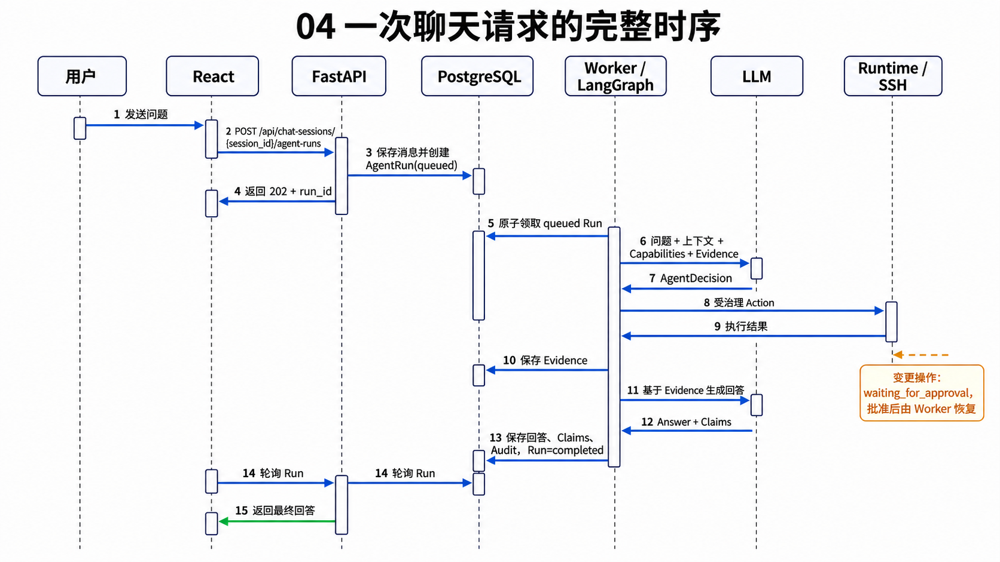

前端发送消息时调用：

```text
POST /api/chat-sessions/{session_id}/agent-runs
```

后端 [create_run()](../../backend/app/agent/service.py) 做的不是调用 LLM，而是：

1. 检查 `client_request_id` 是否已经使用；
2. 保存用户消息；
3. 必要时用消息内容更新会话标题；
4. 创建状态为 `queued` 的 `AgentRun`；
5. 写入 `run.created` 审计事件；
6. 提交事务并返回 202。

精简后的真实逻辑：

```python
user_message = ChatMessage(
    session_id=session.id,
    project_id=session.project_id,
    role="user",
    content=content,
)
db.add(user_message)
db.flush()

run = AgentRun(
    session_id=session.id,
    user_message_id=user_message.id,
    user_id=user_id,
    status="queued",
    current_step="queued_new",
)
db.add(run)
db.commit()
```

### `flush()` 和 `commit()` 的区别

- `flush()`：把当前修改发送给数据库，但事务还没最终提交；此时可以拿到自增 ID。
- `commit()`：正式提交事务，其他事务才稳定地看到结果。

这里先 `flush()` 是因为创建 `AgentRun` 时需要刚生成的 `user_message.id`。

### 为什么要 `client_request_id`

前端使用 `crypto.randomUUID()` 生成请求 ID。后端通过 PostgreSQL advisory lock 和唯一查询保证：

```text
同一个用户 + 同一个会话 + 同一个 client_request_id
```

重复请求只返回原来的 Run，不再创建第二个任务。这用于防止网络重试或用户重复点击导致同一问题执行两次。

前端随后轮询 Run：

```text
queued
→ running
→ waiting_for_approval / completed / failed / cancelled
```

当前不是 SSE 流式输出。聊天页和活动面板通过定时轮询更新，切回浏览器标签页时会立即刷新。

### 面试重点：为什么不在 FastAPI 请求里直接执行 Agent

**面试官可能问：**

> 用户发送消息后，为什么不直接在 FastAPI 接口中调用 LLM 和 SSH，而要先创建 AgentRun 再由 Worker 执行？

**建议回答：**

> 一次运维 Agent 请求可能包含多轮模型决策、多个工具调用、人工审批和执行后验证，耗时不可控。如果放在 HTTP 请求里同步执行，容易遇到网关超时、客户端断开、服务重启丢失状态，也不方便做并发领取和审批恢复。我的实现让 API 只负责鉴权、保存消息和创建 queued 状态的 AgentRun，然后由独立 Worker 原子领取。Run、Graph checkpoint 和执行状态都保存在 PostgreSQL 中，因此前端断开或切换页面不会终止后台任务，等待审批后也能从 checkpoint 恢复。

这个回答需要能够指向三处代码：

- `create_run()`：只创建任务；
- `claim_run()`：Worker 原子领取；
- `resume_run()`：审批后恢复 LangGraph。

---

# 第三部分：LangGraph 和结构化决策

## 9. LangGraph 为什么存在

普通函数也能依次调用 LLM 和 SSH，但它难以处理：

- 中途等待用户审批；
- 审批跨 HTTP 请求、跨 Worker 进程恢复；
- 一轮执行后让模型根据新证据继续判断；
- 保存每个节点的状态；
- 取消、超时和晚到结果。

LangGraph 把这些步骤建成可持久化状态机。

这里必须区分两种“恢复”：

```text
等待审批
→ checkpoint 已保存
→ 用户批准
→ 新的 Worker 使用 Command(resume=...) 继续
```

这是当前已经实现的 checkpoint 恢复。`queued` 的任务也不会因为 Worker 进程重启而
从数据库消失。

但如果 Worker 在 `running` 状态、尤其是真实变更执行中崩溃，当前系统不会从任意
Graph 节点自动重放。租约到期后 `recover_expired_runs()` 会把 Run 标记为
`failed`，把正在执行的 Action 标记为 `execution_unknown`，并要求人工确认目标
状态。这是为了避免重复执行变更。

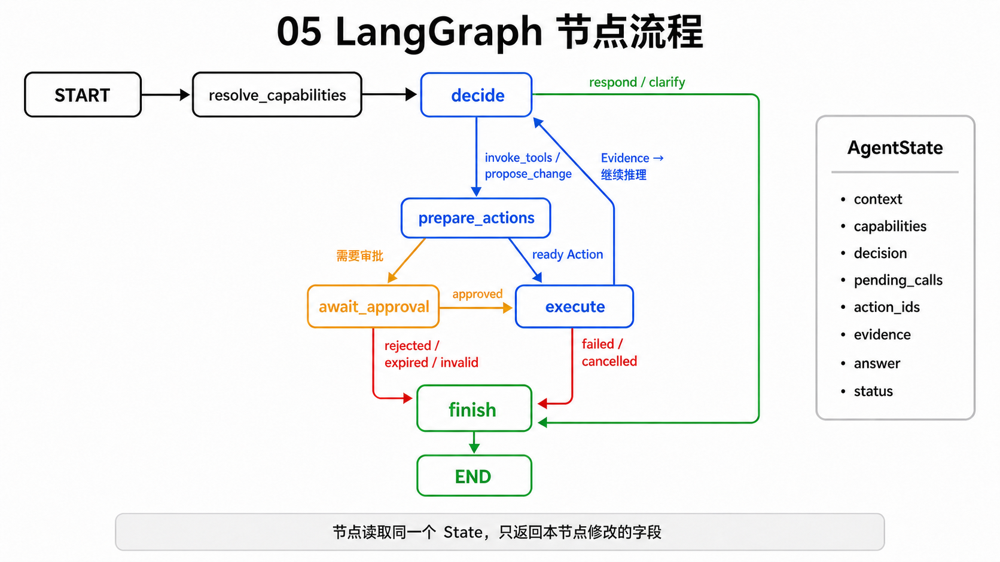

[OpsAgentGraph._build()](../../backend/app/agent/graph.py) 的核心代码是：

```python
graph = StateGraph(AgentState)
graph.add_node("resolve_capabilities", self.resolve_capabilities)
graph.add_node("decide", self.decide)
graph.add_node("prepare_actions", self.prepare_actions)
graph.add_node("await_approval", self.await_approval)
graph.add_node("execute", self.execute)
graph.add_node("finish", self.finish)

graph.add_edge(START, "resolve_capabilities")
graph.add_edge("resolve_capabilities", "decide")
graph.add_conditional_edges(
    "decide",
    self.route_decision,
    {"prepare": "prepare_actions", "finish": "finish"},
)
```

`add_node` 注册节点函数，`add_edge` 定义固定下一步，`add_conditional_edges` 根据路由函数返回值选择下一步。

注意 `execute → decide` 的回路。一次工具执行并不必然结束：

```text
模型先查 service.list
→ 获得服务列表
→ 再决定查 backend 日志
→ 获得新证据
→ 最后生成回答
```

### AgentState

[backend/app/agent/state.py](../../backend/app/agent/state.py) 使用 `TypedDict`。下面只摘出
主链路字段，源码还包含 user/session/context、计数器和错误字段：

```python
class AgentState(TypedDict, total=False):
    run_id: str
    question: str
    capabilities: list[dict[str, Any]]
    pending_calls: list[dict[str, Any]]
    evidence: list[dict[str, Any]]
    answer: str
    status: str
```

`TypedDict` 描述字典允许有哪些 key，让编辑器和类型检查器知道结构；运行时仍然是普通 `dict`。

`total=False` 表示每个字段都可以暂时不存在。因为不同节点只负责补充部分状态。

### 面试重点：为什么选择 LangGraph

**面试官可能问：**

> 这套流程用普通 Python 函数或 while 循环也能写，为什么要使用 LangGraph？

**建议回答：**

> 如果只有一次模型调用和一次工具调用，普通函数就够了。这个项目需要支持模型多轮决策、工具执行后继续推理、人工审批中断，以及审批后由任意可用 Worker 根据 checkpoint 恢复。LangGraph 的价值不是“让模型更智能”，而是把这些步骤建成显式、可持久化的状态机。节点负责单一阶段，条件边负责分支，`interrupt` 负责审批暂停，`thread_id` 绑定 AgentRun。需要强调的是，运行中 Worker 崩溃时系统会 fail closed，不会自动重放状态不明的变更。权限、执行和验证仍由项目自己的确定性代码负责，而不是交给 LangGraph。

## 10. 第一个节点：resolve_capabilities

`resolve_capabilities()` 的任务不是理解自然语言，而是先回答：

> 当前用户在当前项目、当前环境中，到底有哪些能力可以交给模型选择？

它依次：

1. 根据 `project_id` 和 `environment_id` 查询项目与环境；
2. 检查项目和环境是否有效且匹配；
3. 查询用户是 owner 还是 member；
4. 把角色映射成权限集合；
5. 根据 runtime 类型和权限从 Registry 解析 Capability；
6. 若是主动巡检诊断，只保留只读能力；
7. 把 Capability 的结构化 Schema 放进 `AgentState`。

核心代码：

```python
definitions = registry.resolve(runtime_type, permissions)

if state.get("read_only"):
    definitions = [
        item for item in definitions
        if item.effect == "read"
    ]

capabilities = [
    item.model_schema()
    for item in definitions
]
```

这一步决定了 LLM 后续能看到什么。模型看不到的 Capability，即使它“知道”某条 Linux 命令，也不能进入执行链。

当前权限模型是简化版：项目成员目前使用统一的完整项目权限集合。代码结构已经保留角色与权限接口，但细粒度权限后台尚未成为当前重点。

## 11. LLM 的结构化 AgentDecision

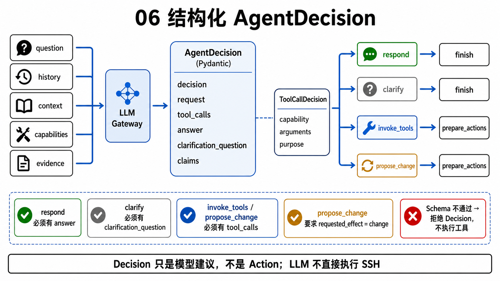

模型不是直接返回一段随意文本让代码猜。它必须返回符合 [AgentDecision](../../backend/app/llm/schemas.py) 的 JSON：

```python
class AgentDecision(BaseModel):
    decision: Literal[
        "respond",
        "clarify",
        "invoke_tools",
        "propose_change",
    ]
    request: RequestUnderstanding
    tool_calls: list[ToolCallDecision]
    answer: str | None
    clarification_question: str | None
    claims: list[ClaimDraft]
```

四种决策含义：

| decision | 含义 |
|---|---|
| `respond` | 直接回答，不调用工具 |
| `clarify` | 信息不足，请用户补充 |
| `invoke_tools` | 调用只读工具收集信息 |
| `propose_change` | 提议会改变状态的操作 |

Pydantic 还会检查组合是否合法：

```python
if self.decision == "respond" and not self.answer:
    raise ValueError("respond requires answer")

if self.decision in {"respond", "clarify"} and self.tool_calls:
    raise ValueError("respond and clarify cannot include tool_calls")

if self.decision == "propose_change" \
        and self.request.requested_effect != "change":
    raise ValueError(
        "propose_change requires requested_effect=change"
    )
```

因此下面这种输出会被拒绝：

```json
{
  "decision": "respond",
  "answer": "Redis 正常",
  "tool_calls": [
    {"capability": "service.stop", "arguments": {"service": "redis"}}
  ]
}
```

LLM Gateway 会在第一次结构化解析失败时请求模型修复一次；仍然无效则 fail closed，任务不会继续执行工具。

### 模型配置并没有写死为 DeepSeek

[backend/app/llm/configuration.py](../../backend/app/llm/configuration.py) 按下面的优先级解析模型配置：

```text
当前 AgentRun.user_id
→ 查询 UserLLMSettings
→ 有用户配置：使用用户的 provider / base_url / model / API Key
→ 没有用户配置：回退到部署级 LLM_* 配置
→ 两边都没有有效 API Key：明确失败，不伪造模型回答
```

`.env.example` 当前用 DeepSeek 作为默认示例，但 Gateway 通过 OpenAI-compatible
`chat.completions` 接口调用，provider、base URL 和 model 都可以配置。前端账号设置
可以打开模型设置，用户配置保存在 `user_llm_settings` 表中。

API Key 的处理边界是：

- 数据库只保存 Fernet 加密后的 `api_key_encrypted`；
- 加密密钥来自独立的 `LLM_CREDENTIAL_ENCRYPTION_KEY`，未设置时才回退到
  `APP_SECRET_KEY` 派生密钥；
- API 响应只返回是否已配置和配置来源，不返回原始 Key；
- base URL 必须在服务端 `LLM_ALLOWED_BASE_URLS` 允许列表中；
- 生产环境只允许 HTTPS，并拒绝 URL 中的账号、密码、query 和 fragment；
- 用户切换模型服务地址时必须提交与新服务匹配的 Key。

这解决的是“每个用户选什么模型、密钥如何服务端保存”。它不改变 Agent 的权限：
无论使用哪个模型，输出仍必须通过同一个 `AgentDecision` Schema、Registry 和 Policy。

### 结构化 Decision 不等于安全授权

它只表示：

> 模型提出了一个格式正确的计划。

后面仍然要经过：

```text
Registry 存在性检查
→ 参数 Schema 校验
→ Policy 判断
→ Action 快照与 Hash
→ 必要时人工审批
→ Runtime 执行
→ Verifier 验证
```

### 面试重点：系统怎么理解用户问题，又怎么识别高危操作

**面试官可能问：**

> 你是靠关键词把用户问题分成查询、诊断和高危操作吗？

**建议回答：**

> 不是用不断追加关键词的方式决定执行。LLM 先把自然语言解析成经过 Pydantic 校验的 `AgentDecision`，其中包含目标、范围、时间关注点、期望 effect 和结构化 tool calls。模型负责语义理解，但没有授权权力。真正的危险等级、是否允许、是否需要审批，由服务端根据 Capability 定义和 Policy Engine 确定。比如“删除容器通常有什么后果”可以被模型识别为通用知识并直接回答；只有模型实际提出变更 Capability 时，才会进入 Action 和审批链。即使模型误判，Registry 和 Policy 也会 fail closed。

## 12. 从 Decision 到 Action

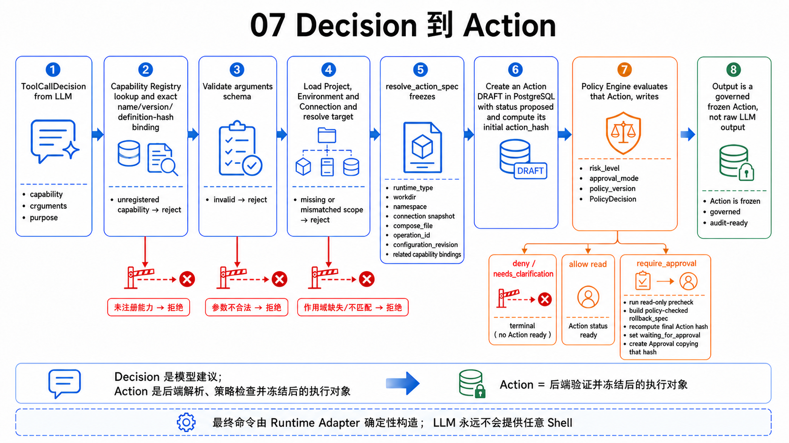

`prepare_actions()` 把模型的语义提议变成数据库中的具体 `Action`。

例如模型输出：

```json
{
  "decision": "propose_change",
  "tool_calls": [
    {
      "capability": "service.restart",
      "arguments": {"service": "backend"},
      "purpose": "恢复后端服务"
    }
  ]
}
```

系统不会直接拼成 Shell。它先做：

1. Capability 是否存在；
2. 是否包含在本轮给模型的可用能力中；
3. `effect` 是否和决策类型一致；
4. 参数是否满足 Schema；
5. 本轮是否有重复调用；
6. 项目、环境和 SSH Connection 是否匹配；
7. Runtime Adapter 需要的最终执行配置是什么；
8. 创建并持久化状态为 `proposed` 的 Action 草稿；
9. Policy 判断允许、拒绝、澄清还是需要审批；
10. 使用 Policy 确定的风险等级更新 Action，并重新计算 Hash；
11. 对需要审批的变更执行 Precheck、生成 rollback spec，再计算最终审批 Hash。

这里必须注意顺序：Policy 需要读取已经解析好的 Action 目标和参数，因此不是
“Policy 通过后才创建 Action”。被拒绝或需要澄清的提议也会留下 Action 和
PolicyDecision，便于审计为什么没有执行；只有 `ready` 或审批后变为 `approved`
的 Action 才可能进入真实执行。

### Action 和执行不是一回事

```text
Action 创建成功
≠ 已执行
≠ 执行成功
≠ 验证成功
```

Action 只是把“准备做什么”持久化，后续状态机再推动它前进。

## 13. Capability Registry

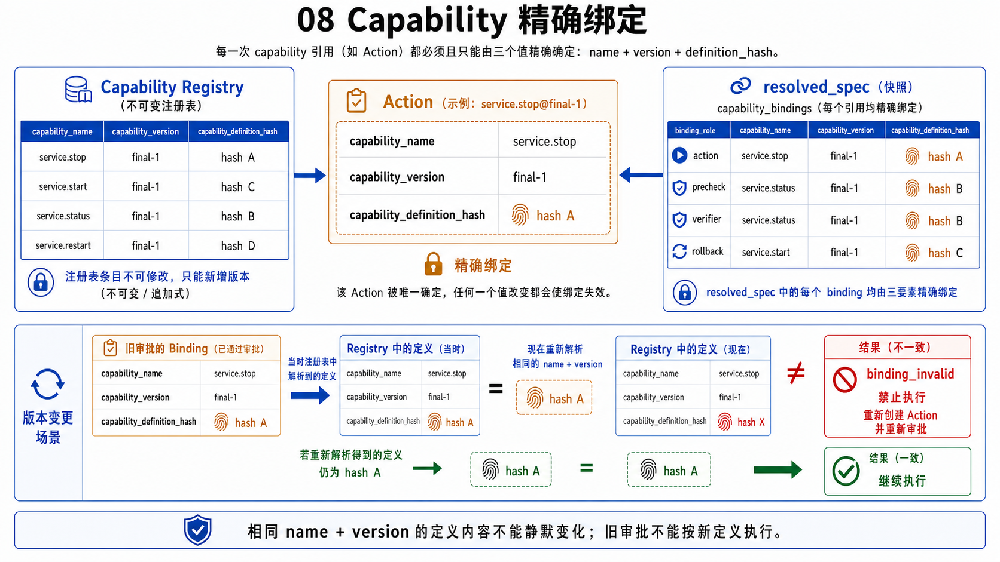

当前 [core.yml](../../backend/app/capabilities/definitions/core.yml) 包含几类能力：

```text
项目上下文：
  project.context.get
  relationship.dependencies
  relationship.impact
  experience.search

只读运维：
  service.list
  service.status
  service.logs
  service.inspect
  http.health_check
  host.disk_usage
  host.memory_usage
  host.listening_ports

变更：
  service.start
  service.stop
  service.restart
  service.scale
  deployment.apply_registered
  config.update_registered
```

Registry 不只是读 YAML，它会在启动时编译并校验：

- `name + version` 唯一；
- 参数 Schema 合法；
- executor 存在；
- runtime 类型受支持；
- read 能力不能偷偷要求变更审批；
- change 能力必须有明确审批规则；
- change 能力必须绑定 precheck 和 verifier；
- 相关 precheck、verifier、rollback 能力必须存在且类型兼容。

每个定义还会计算 `definition_hash`。执行时绑定的是：

```text
Capability name
+ version
+ definition_hash
```

如果开发者不提升版本，却偷偷修改相同版本的 YAML 内容，Registry 与数据库同步会拒绝静默覆盖。旧 Action 也必须通过 `get_bound(name, version, definition_hash)` 找到完全相同的定义，不能按新定义执行。

### Capability 是否限制 Agent

是，而且这是有意的安全边界。

当前项目没有开放任意 `shell.execute`。Agent 能自动执行的是 Registry 中已经被确定性实现、可审计、可验证的能力。能力不足时应：

- 给出已有证据；
- 明确说明缺少什么能力；
- 由开发者新增或升级 Capability；
- 不能绕过 Registry 临时执行未知命令。

这会牺牲一部分自由度，但换来审批和执行语义的一致性。

### 面试重点：Capability Registry 会不会限制 Agent 能力

**面试官可能问：**

> 只能执行 Registry 中的能力，会不会让 Agent 遇到新问题时什么都做不了？

**建议回答：**

> 会限制自动执行范围，但这是运维 Agent 必须明确做出的安全取舍。Registry 不是简单命令白名单，而是参数、权限、runtime、风险、precheck、verifier 和 rollback 的语义合同。未知问题仍然可以通过已有只读能力收集证据并给出诊断，但不能让 LLM 临时拼接未经验证的写命令。发现稳定的新需求后，我会新增带版本的 Capability、Adapter 解析和测试。这样扩展速度比任意 Shell 慢，但每项自动化都能审批、验证和审计。

---

# 第四部分：Action、Hash、Policy 与 Approval

## 14. Action 的不可变执行快照

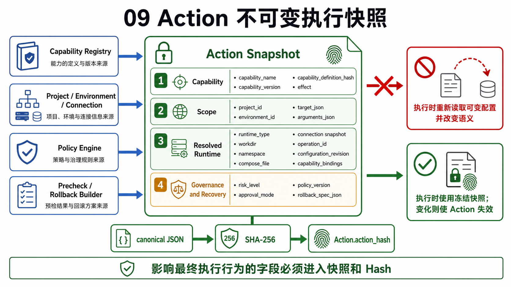

一次 Action 不能只保存：

```json
{"capability": "service.stop"}
```

否则审批后重新读取环境配置时，目标服务器、工作目录或服务名可能已经变化。

[resolve_action_spec()](../../backend/app/agent/graph.py) 会解析并保存：

- runtime 类型；
- workdir；
- namespace；
- connection id；
- compose file；
- operation id；
- configuration revision；
- Capability 及其 precheck、verifier、rollback 的精确绑定；
- SSH Connection 的 host、port、username、credential ref、host fingerprint；
- 已登记部署或配置修改的具体 recipe。

Action Hash 使用的完整快照由
[action_snapshot()](../../backend/app/policy/action_hash.py) 定义：

```python
def action_snapshot(action):
    return {
        "capability": action.capability_name,
        "version": action.capability_version,
        "definition_hash":
            action.capability_definition_hash,
        "risk_level": action.risk_level,
        "approval_mode": action.approval_mode,
        "policy_version": action.policy_version,
        "config_revision": action.config_revision,
        "project_id": action.project_id,
        "environment_id": action.environment_id,
        "target": action.target_json,
        "arguments": action.arguments_json,
        "resolved_spec": action.resolved_spec_json,
        "rollback_spec": action.rollback_spec_json,
        "effect": action.effect,
    }
```

这就是“会影响实际执行行为的字段”在当前代码中的准确范围。

这里的“不可变”是安全语义，不是说 PostgreSQL 从物理上禁止更新 Action 行。
Action 内容如果因为程序错误被修改，原 Hash 不会自动跟着变化，后续现场重算就会
发现不一致并使执行失效。环境或连接配置属于 Action 之外的当前状态，则由
`configuration_revision` 重新计算并单独校验。

## 15. Action Hash 和 Approval

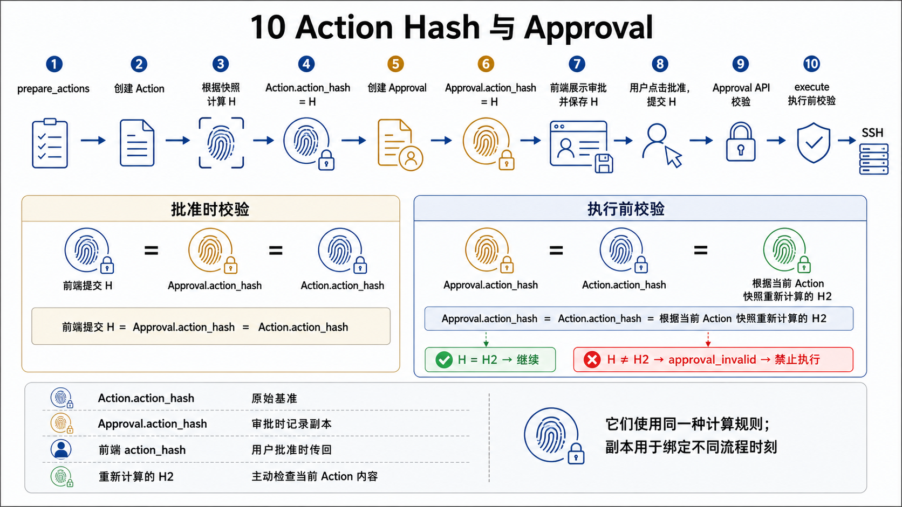

Hash 算法只有一个：

```python
def compute_action_hash(payload):
    canonical = json.dumps(
        payload,
        ensure_ascii=True,
        sort_keys=True,
        separators=(",", ":"),
    )
    return hashlib.sha256(
        canonical.encode("utf-8")
    ).hexdigest()
```

不要把它理解成四种不同 Hash。完整链路中是同一个 Action 指纹在不同时间、不同记录中的四个值：

| 位置 | 作用 |
|---|---|
| `Action.action_hash` | Action 创建时保存的基准指纹 |
| `Approval.action_hash` | 创建审批时复制，记录当时让用户审批的是哪份 Action |
| 前端提交的 `action_hash` | 用户点击批准时，把页面看到的审批指纹传回 |
| 现场重新计算的 Hash | 后端根据数据库中当前 Action 内容再次计算，不单独保存 |

审批 API 的核心关系是：

```text
前端提交的 Hash
= Approval.action_hash
= Action.action_hash
= 根据当前 Action 快照重新计算的 Hash
```

为什么需要这些位置？

- 前端值防止用户批准了已经过时的页面；
- Approval 值把“审批记录”绑定到当时的 Action；
- Action 值是 Action 自身的基准；
- 重新计算值检查 Action 内容与基准指纹是否仍一致。

Hash 不是为了证明数据库绝对无法被攻击。它主要防止正常系统中的：

- 旧页面提交；
- 并发审批；
- 程序错误修改 Action；
- 恢复流程错误复用旧 Action。

这里要准确区分三类检查：

```text
四个 Action Hash 值相等
→ 证明前端、Approval、Action 基准和 Action 当前快照一致

当前 configuration_revision == Action.config_revision
→ 证明 Environment / Connection 配置没有漂移

Registry.get_bound(name, version, definition_hash) 成功
→ 证明 Capability 仍是 Action 当时绑定的精确定义
```

因此，审批期间环境配置变化和 Capability 定义漂移会阻止执行，但不是仅靠“四个
Hash 相等”发现的，而是由执行前的配置版本和 Capability binding 检查发现。

[approvals.py](../../backend/app/api/approvals.py) 中的关键检查：

```python
if approval.action_hash != action.action_hash \
        or action.action_hash != compute_action_hash(
            action_snapshot(action)
        ):
    raise HTTPException(
        409,
        "Action has changed; approval is invalid",
    )

if payload.action_hash != approval.action_hash:
    raise HTTPException(
        409,
        "The submitted Action Hash "
        "does not match this approval",
    )
```

SSH 执行前还会再次检查 Hash、Capability 精确定义、Policy 版本和配置版本。审批通过不是永久通行证。

### 面试重点：为什么审批链里要保存并重算 Action Hash

**面试官可能问：**

> 数据库已经保存了 Action，为什么还要有 Action Hash、Approval Hash 和执行前重算？

**建议回答：**

> 它们使用的是同一种 Hash，不是多套算法。`Action.action_hash` 保存最终审批快照的指纹；创建审批时把它复制到 `Approval.action_hash`，记录用户当时看到并审批的是哪份 Action；前端点击批准时再把页面收到的 Hash 传回。后端批准时和执行前都会根据 Action 当前内容现场重算。四个值必须一致，用于排除旧页面、并发审批、程序错误修改 Action 和恢复流程误用。环境配置漂移由 `configuration_revision` 单独检查，Capability 漂移由 `name + version + definition_hash` 精确绑定检查。Hash 的目标是保证“用户批准的 Action 快照就是最终准备执行的 Action 快照”，不是宣称数据库绝对不可攻击。

## 16. Policy Engine

Policy Engine 回答的是：

> 这个用户在这个项目和环境中，能否以这种方式操作这个目标？

它不会把 LLM 的风险判断当成授权。当前策略包括：

- 项目和环境必须有效且匹配；
- 用户必须是项目 owner 或 member；
- 权限必须包含所需读写能力；
- runtime 与 Capability 必须匹配；
- 目标服务必须在项目上下文范围内；
- L0 只读能力通常允许；
- L3 或明确禁止的操作拒绝；
- 生产环境停止服务或缩容到 0 拒绝；
- 普通变更进入显式审批；
- 主动修复只能在严格条件下使用预授权。

低风险自动修复不是“打开开关后 Agent 想做什么都能做”。当前只允许：

```text
来源是 active_monitor
+ 主动巡检开启
+ 低风险自动修复开启
+ 环境为 dev/test
+ 异常是同一服务已停止
+ 动作是 service.start
+ 有新鲜 precheck 证据
```

## 17. Action 状态机

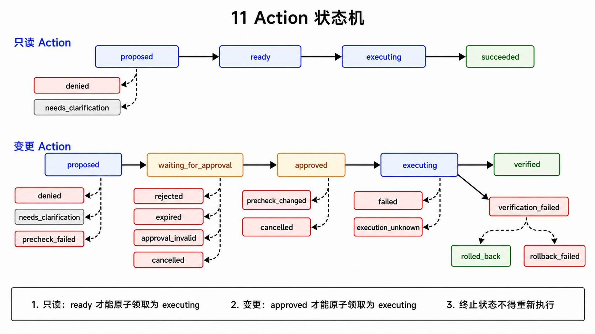

只读 Action 的典型状态：

```text
proposed
→ ready
→ executing
→ succeeded / failed
```

变更 Action 的典型状态：

```text
proposed
→ waiting_for_approval
→ approved
→ executing
→ verified
```

常见失败分支包括：

```text
denied
needs_clarification
precheck_failed
rejected
expired
approval_invalid
cancelled
precheck_changed
failed
execution_unknown
verification_failed
rolled_back
rollback_failed
```

三个容易混淆的成功状态：

| 状态 | 含义 |
|---|---|
| `succeeded` | 只读、Precheck 或 Verifier Action 的工具调用成功；变更本体仍需进入 `verified` |
| `approved` | 用户允许执行，还没证明执行成功 |
| `verified` | 变更执行后，Verifier 证明目标状态符合预期 |

因此：

```text
审批通过 ≠ 执行成功
命令 exit code 0 ≠ 目标状态正确
AgentRun completed ≠ 每个结论置信度 1.0
```

## 18. 审批等待和恢复

LangGraph 在 `await_approval()` 中调用 `interrupt(payload)`。此时：

1. Graph 状态写入 PostgreSQL checkpoint；
2. Run 进入 `waiting_for_approval`；
3. API 把审批内容显示给用户；
4. 用户批准或拒绝；
5. 审批 API 原子更新 Approval；
6. 没有剩余待审批项时，把 Run 放回 `queued_resume`；
7. Worker 再次领取；
8. `Command(resume={"approved": True})` 从 checkpoint 恢复。

批量审批时，前端可以只选择部分 Action：

- 选中的 Approval 记为 approved；
- 未选中的记为 rejected；
- 每个已执行 Action 分别验证最终状态。

审批只能有效消费一次。执行器领取 Action 时，会原子地把 Action 从 `approved` 变为 `executing`，并写入执行令牌；相关 Approval 的 `consumed_at` 也只能首次写入。

---

# 第五部分：Worker、并发与异常恢复

## 19. AgentRun、Worker 与并发控制

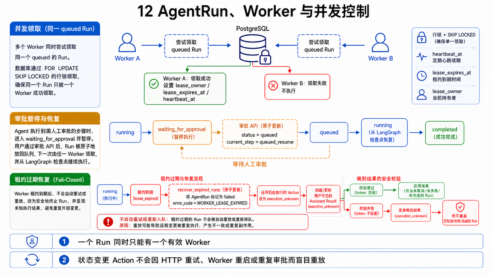

[backend/app/worker.py](../../backend/app/worker.py) 是独立进程，不是 FastAPI 的后台线程。它持续：

1. 更新 Worker 心跳；
2. 领取 queued AgentRun；
3. 执行或恢复 LangGraph；
4. 扫描主动巡检；
5. 恢复过期租约；
6. 处理上下文采集任务。

### 原子领取

`claim_run()` 使用：

```python
select(AgentRun)
.where(AgentRun.status == "queued")
.with_for_update(skip_locked=True)
```

`FOR UPDATE SKIP LOCKED` 的作用：

- 一个 Worker 锁住某一行后，其他 Worker 跳过它；
- 多个 Worker 可以并行领取不同 Run；
- 同一 Run 不会被两个 Worker 同时正常领取。

领取后写入：

```text
status = running
lease_owner = 当前 worker id
heartbeat_at = 当前时间
lease_expires_at = 当前时间 + 30 秒
```

执行期间独立心跳线程每 5 秒续租。

### Worker 崩溃怎么办

租约过期后，恢复流程：

- 把 Run 标记为 `failed`；
- 把正在执行的 Action 标记为 `execution_unknown`；
- 取消尚未开始的 Action；
- 不自动重放变更；
- 告诉用户先确认目标真实状态。

这是因为 Worker 断开时，系统不知道远端命令：

```text
完全没执行
已经执行成功
执行到一半
成功但结果还没写回数据库
```

自动重试可能造成重复变更，所以系统选择 fail closed。

### 晚到结果

如果用户取消任务或租约已失效，旧 Worker 后来才返回结果，系统不会用这个结果覆盖 `cancelled` 或恢复流程写入的 `failed`。

这依赖：

- Run 状态条件更新；
- `lease_owner`；
- Action `execution_token`；
- 持久化前重新读取状态。

### 为什么 recursion_limit 很大

当前 `_graph_config()`：

```python
return {
    "configurable": {"thread_id": run_id},
    "recursion_limit": 1_000_000,
}
```

这个值不是允许一百万次工具调用。项目取消了人为的 50 次工具上限，真正边界是：

- 用户取消；
- Agent 总墙钟超时；
- Policy 和能力边界；
- Worker 租约；
- Graph 终态。

### 面试重点：如何避免重复执行和 Worker 异常造成误操作

**面试官可能问：**

> 用户重复点击、HTTP 重试、多个 Worker 或 Worker 执行中崩溃时，怎么避免同一个变更执行多次？

**建议回答：**

> 请求入口用 `client_request_id` 和数据库锁保证同一请求幂等；Worker 用 `FOR UPDATE SKIP LOCKED` 原子领取 Run；Action 从 `ready/approved` 进入 `executing` 时使用条件更新并生成 execution token；Approval 只能原子消费一次。Worker 还通过 lease owner 和心跳证明执行所有权。如果租约过期，正在执行的 Action 会进入 `execution_unknown`，系统不会自动重放变更，晚到结果也不能覆盖失败或取消状态。这里选择的是“状态不明时停止并要求重新确认”，而不是冒险重试。

---

# 第六部分：Runtime、SSH、验证与回滚

## 20. Runtime Executor 与 Adapter

模型只选择：

```json
{
  "capability": "service.status",
  "arguments": {"service": "backend"}
}
```

确定性代码先根据 Capability 类型选择执行路径。其中 `service.*` 生命周期能力再根据
Environment runtime 选择具体 Adapter，`host.*` 和 `http.health_check` 则按能力类型
进入各自的 Adapter：

```text
service.* + docker_compose → Docker Adapter
service.* + kubernetes     → Kubernetes Adapter
service.* + systemd        → systemd Adapter
host.*                     → Host Adapter
http.health_check          → HTTP Adapter
registered_*               → 已登记配置或部署 Adapter
```

Adapter 负责构造命令和解析输出，LLM 不负责拼接任意 Shell。

`RuntimeExecutor` 在执行前还会重新读取并核对：

- Environment；
- Connection；
- configuration revision；
- Capability 精确绑定；
- Action 执行所有权；
- 路径和已登记 recipe。

其中 `deployment.apply_registered` 和 `config.update_registered` 不是让模型提交任意
manifest、路径或文件内容。可部署 recipe 和可修改配置必须预先登记在
`Environment.config_json` 中，Action 只引用已登记名称，并把最终解析结果写入不可变
快照。

配置文件修改还会：

```text
校验相对路径位于 workdir
→ 对比 current_sha256 或明确允许新建
→ SFTP 写临时文件
→ 必要时保存备份
→ 原子 rename
→ Verifier 校验最终 SHA-256
```

`http.health_check` 同样不是任意 URL 请求。它只能访问环境中登记的健康地址，执行前
会解析 DNS、拒绝 link-local/multicast/reserved/unspecified 地址、固定本次访问 IP、
禁止重定向，并把响应体限制在 4 KiB。这些检查用于降低 SSRF、DNS 变化和超大响应带来
的风险。

## 21. SSH 执行安全检查

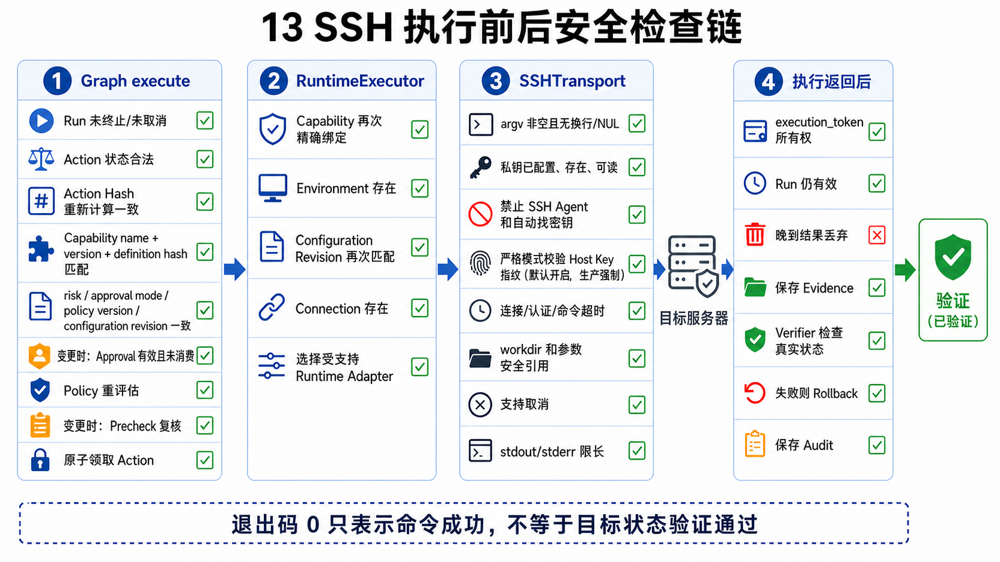

[backend/app/runtime/transports/ssh.py](../../backend/app/runtime/transports/ssh.py) 使用 Paramiko。连接规则包括：

- 只使用 `credential_ref` 指向的私钥；
- `look_for_keys=False`；
- `allow_agent=False`；
- 不自动尝试本机其他 SSH Key；
- 默认严格验证 Host Key 指纹；
- 有连接和命令超时；
- 参数拒绝 NUL 和换行；
- stdout/stderr 有大小上限；
- 支持取消；
- 可在一轮执行中复用 SSH 连接；
- SFTP 修改文件时限制在 workdir 内；
- 拒绝 `..` 路径逃逸并检查符号链接。

连接链路可以概括为：

```text
数据库 Connection
→ 容器内 credential_ref
→ 检查私钥存在且可读
→ 连接 host:port
→ 校验 Host Key 指纹
→ 以 username 登录
→ 执行 Adapter 构造的命令
→ 截断并保存 stdout/stderr/exit code
```

`SSH_STRICT_HOST_KEY_CHECKING` 默认是 `true`，生产配置校验也禁止将它关闭；严格模式下
Connection 缺少指纹会直接失败。开发环境技术上允许显式关闭严格模式，此时 Paramiko
会接受未知 Host Key，但这会削弱服务器身份保证，不应作为生产部署方式。

### SSH 用户和 sudo

SSH 连接使用目标服务器上已经存在的用户，例如 `opsagent`。项目不会因为用户名叫 opsagent 就自动获得 sudo。

权限来自目标服务器：

- 该用户能否进入项目目录；
- 是否属于 docker 组；
- 是否能运行 `docker compose`；
- 是否被授予有限 sudoers 规则。

推荐最小权限，不要直接把免密 root 当成默认方案。

### 为什么 Host Key 指纹和私钥不是一回事

- 私钥证明“客户端是谁”；
- Host Key 指纹证明“连接的服务器是谁”。

两者缺一不可。只验证私钥但不验证服务器身份，会增加中间人攻击风险。

### 面试重点：SSH 执行链做了哪些安全限制

**面试官可能问：**

> 你的 Agent 最终还是通过 SSH 执行命令，怎么避免它变成一个远程任意命令执行器？

**建议回答：**

> LLM 不能直接提交 Shell 字符串，只能选择 Capability；命令由 runtime adapter 根据经过 Schema 校验的参数确定性构造。SSH Transport 关闭 SSH agent 和本机自动找 key，只读取 Connection 指向的私钥；默认和生产环境都要求严格校验 Host Key 指纹。目标路径限制在环境 workdir，参数拒绝换行和 NUL，输出和超时都有上限，SFTP 还检查路径逃逸和符号链接。目标服务器上的 `opsagent` 用户也采用最小权限，能否操作 Docker 或 systemd 由服务器权限决定，系统不会自动获得 sudo。

## 22. Precheck、Execute、Verifier、Rollback

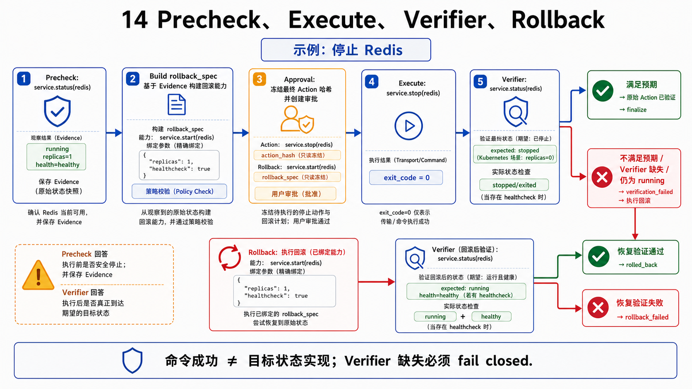

变更链路不是只运行一次命令：

```text
Precheck
→ Approval
→ 审批后重新 Precheck
→ Execute
→ Verifier
→ Verified 或 Rollback
```

### Precheck

记录执行前状态，例如：

- 服务原来是否运行；
- 原副本数是多少；
- 当前配置文件 Hash 是什么。

审批后还会重新做一次 Precheck。如果状态与审批前不同，Action 进入 `precheck_changed`，不能继续使用旧审批。

### Execute

执行实际变更，例如启动、停止、重启或调整副本数。

### Verifier

Verifier 是独立的只读 Action。它检查业务目标，不只检查命令退出码。

[verification.py](../../backend/app/runtime/verification.py) 对不同 runtime 有不同判断：

- Docker start/restart：容器必须 running；存在 healthcheck 时必须 healthy；
- Docker stop：目标容器必须处于停止状态；
- Docker scale：实际副本数必须等于目标；
- Kubernetes：desired、available、updated、unavailable 必须符合预期；
- systemd：检查 `ActiveState` 和 `SubState`；
- 配置修改：校验最终文件 Hash；
- 已登记部署：校验预期实例状态。

未找到 verifier 或 verifier 无法判断时，必须失败，不能默认成功。

### Rollback

验证失败时，系统根据执行前状态尝试恢复：

- 原来运行，stop 失败后可 start；
- 原来停止，start 后异常可 stop；
- scale 恢复原副本数；
- 配置修改恢复备份；
- 已登记部署使用明确的恢复策略。

Rollback 也不等于一定成功，所以有 `rolled_back` 和 `rollback_failed` 两种结果。

### 面试重点：如何证明操作真的成功

**面试官可能问：**

> SSH 命令返回 exit code 0，不就说明操作成功了吗，为什么还要单独的 Verifier？

**建议回答：**

> exit code 0 只能证明命令进程认为自己执行完成，不能证明业务目标已经达到。例如 `docker compose up` 成功返回后，容器仍可能立即退出或 healthcheck 为 unhealthy。因此变更前先用 Precheck 保存原状态，执行后再创建独立只读 verifier Action：启动和重启要检查 running，有 healthcheck 时还要 healthy；扩缩容要检查真实副本数；systemd 要检查 ActiveState；配置修改要检查最终 Hash。没有 verifier 或 verifier 无法解析时 fail closed，验证失败则根据执行前状态尝试 rollback。只有验证通过的变更才能标记 `verified`。

---

# 第七部分：Evidence、Claim、Audit 与项目知识

## 23. Evidence、Claim 和 Audit

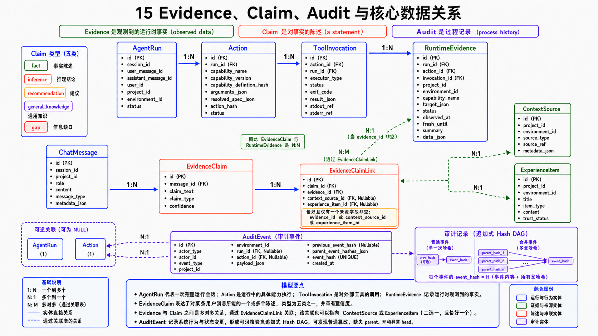

三者回答不同问题：

| 对象 | 回答的问题 | 示例 |
|---|---|---|
| Evidence | 工具实际观察到了什么？ | backend 状态是 exited(127) |
| Claim | Agent 根据哪些证据说了什么？ | backend 当前没有运行 |
| Audit | 系统过程发生了什么？ | 用户批准了 service.start |

### Evidence

一次真实调用关系是：

```text
Action
→ ToolInvocation
→ RuntimeEvidence
```

`RuntimeEvidence` 保存 Capability、目标、结构化输出、摘要、观察时间和来源调用；
与它一一对应的 `ToolInvocation` 还保存经过脱敏和长度限制的 stdout、stderr、exit
code 与执行耗时。具体包括：

- Capability；
- 目标；
- 结构化输出；
- 工具结果摘要；
- exit code；
- 时间；
- 来源调用。

### Claim

Claim 类型包括：

| 类型 | 含义 |
|---|---|
| `fact` | 证据直接支持的事实 |
| `inference` | 根据一个或多个事实形成的推断 |
| `recommendation` | 建议 |
| `general_knowledge` | 不依赖项目实时证据的通用知识 |
| `gap` | 信息不足或无法确认 |

`fact` 没有任何证据链接时，会被降级为较低置信度的 `inference`。完整回答也不会直接被当成一个置信度 1.0 的事实。

`EvidenceClaimLink` 保证一条链接只能指向以下一种来源：

- RuntimeEvidence；
- ContextSource；
- ExperienceItem。

数据库约束保证每条 Link 只指向一种来源，持久化代码也只接受本次 Run 实际可用的
来源 ID。但它不能仅靠外键判断某条证据在语义上是否真的支持 Claim；这部分仍依赖
模型给出正确引用、置信度限制以及后续人工或评测检查。

### Audit

AuditEvent 的正常单头写入看起来像 append-only Hash Chain：

```text
前一事件 Hash
→ 当前事件内容
→ 当前事件 Hash
```

当前 `hash_version=2` 还支持一个事件引用多个 parent。如果历史并发或旧数据产生多个
head，下一次追加会创建 merge event，把所有 head 合并成一个。因此更准确地说，当前
实现是“通常表现为链、支持多 parent 合并的 append-only Hash DAG”，而不是只能有一个
previous 的简单链。

数据库禁止普通 UPDATE/DELETE 审计事件。校验器会检查：

- Hash 是否正确；
- parent 是否存在；
- 是否有环；
- 顺序是否合法；
- 最终是否只有一个 head，以及 merge event 数量。

审计链不能阻止具有数据库超级权限的人重建整套数据，但可以发现普通程序错误、非法更新和链断裂。

### 面试重点：为什么要把 Evidence、Claim 和 Audit 分开

**面试官可能问：**

> 直接保存 Agent 最终回答和执行日志不就够了吗，为什么还设计 Evidence、Claim 和 Audit？

**建议回答：**

> 三者解决的问题不同。Evidence 是工具直接观察到的原始事实，例如容器状态和退出码；Claim 是模型基于具体 Evidence 得出的事实、推断或建议，并通过 Link 精确关联来源；Audit 记录谁在何时创建 Run、批准 Action、执行或取消了什么。分开后可以检查某句话有没有证据支持，也能区分“模型推断错误”和“工具执行过程违规”。项目还限制无证据的 fact，会把它降级为低置信度 inference；Audit 则使用支持多 parent 合并的 append-only Hash DAG 检测普通修改、缺失 parent、环和异常 head。

## 24. 项目上下文与经验

当前系统不是“所有问题必须命中向量 RAG 才回答”。

处理方式是：

```text
通用知识问题
→ LLM 直接回答

项目静态事实
→ 项目上下文实体、关系和来源

实时状态
→ Runtime Capability

历史故障经验
→ experience.search
```

项目上下文采集器可以从不同运行形态和项目文件提取：

- 服务实体；
- 配置来源；
- 依赖关系；
- 影响关系；
- 项目说明。

采集不是在聊天 HTTP 请求中同步完成。API 创建 `CollectorRun`，Worker 使用
`FOR UPDATE SKIP LOCKED` 领取并维护 30 秒租约。相同 environment 和 collector
同时只能存在一个 queued/running 任务。当前 collector 包括：

- manual；
- Docker Compose；
- Kubernetes；
- systemd；
- 项目文件；
- Nginx 配置。

Collector 运行中取消会回滚本轮未提交结果；Worker 租约过期则把采集任务标记为
`failed` 或 `cancelled`，同样不会自动重放。

经验库保存的是已验证历史经验，用于帮助模型理解：

- 过去出现过什么故障；
- 哪些证据支持当时结论；
- 什么处理方式有效；
- 适用于哪些项目和环境。

经验不是实时事实，不能用一条旧经验证明“服务现在已经停止”。实时状态仍然必须由工具读取。

当前经验检索的实现也要如实理解：`ExperienceItem` 会按段落切成
`ExperienceChunk`，查询只返回 `trust_status=verified` 的项目经验；排序使用
PostgreSQL `to_tsvector/plainto_tsquery`、`ILIKE` 和简单词频分数。模型中虽然预留了
`embedding_json` 字段，当前检索链并没有使用 pgvector embedding 或 reranker。因此它
是受信项目经验检索，不应在面试中描述成已经完成的向量 RAG。

系统目前也不会因为某次对话发现新问题，就自动生成并启用新的 Capability 或巡检规则。自动学习未经治理的运维规则会扩大执行边界，因此新规则仍需开发和测试。

---

# 第八部分：主动巡检和前端

## 25. 主动巡检、诊断和低风险自动修复

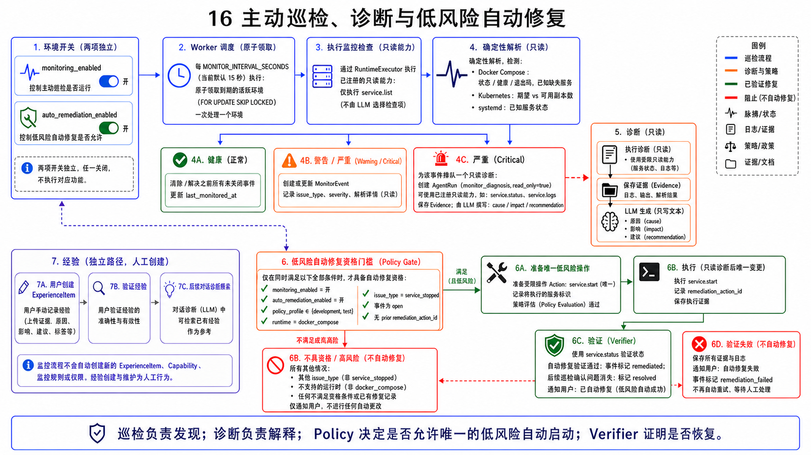

主动巡检运行在 Worker 中，不依赖用户发消息。

当前基础流程：

```text
按环境间隔领取巡检任务
→ 调用 service.list
→ 确定性识别服务停止等问题
→ 创建或更新 MonitorEvent
→ critical 事件创建只读诊断 AgentRun
→ 收集 service.status / service.logs
→ LLM 生成原因、影响和建议
→ 满足严格条件时尝试低风险 service.start
→ Verifier 验证
→ 更新事件为 remediated / remediation_failed / resolved
```

MonitorEvent 当前合法状态是：

| 状态 | 含义 |
|---|---|
| `open` | 问题存在，等待处理 |
| `remediating` | 正在自动修复 |
| `remediated` | 自动修复并验证通过 |
| `remediation_failed` | 自动修复执行或验证失败 |
| `resolved` | 后续巡检确认问题已经消失 |

同一 environment、service 和 issue type 的未恢复问题不会每次创建一条完全无关的
记录，而会更新 `last_seen_at` 和 `occurrence_count`。问题在后续巡检中消失后会标记
`resolved`。

不是每个异常都会创建 LLM 诊断。当前只有 `critical` 且处于 `open` 或
`remediation_failed`、并且尚未创建诊断 Run 的事件，才会排队一个只读诊断
`AgentRun`。Docker Compose 中普通的 `service_stopped` 当前是 warning；缺失预期
服务、无法解析状态、明确 unhealthy 等情况才可能是 critical。

### 为什么前端停了看不到提示

主动巡检可能仍在后端发现并修复前端，但如果 Ops Agent Chat 自己的前端不可访问，用户无法通过这个页面看到通知。

生产化需要独立告警通道，例如邮件、企业聊天或独立监控平台。当前网页通知不能替代外部告警。

### 主动巡检范围怎么确定

当前巡检范围不是 LLM 随机决定，主要由：

- Environment 配置；
- runtime 类型；
- `service.list` 可观察到的服务；
- Docker Compose 的 `known_services`，以及 systemd 必填的 `known_services`；
- 确定性问题检测逻辑；
- Policy 允许的自动修复能力。

这种设计可预测，但不会自动覆盖所有未知故障。对复杂问题，巡检发现异常后创建只读诊断 Run，再由 Agent 收集更多证据。

### 面试重点：主动巡检和自动修复如何控制风险

**面试官可能问：**

> 主动巡检是不是让 LLM 自己决定检查什么、发现问题后自动执行修复？

**建议回答：**

> 不是。基础巡检范围由环境配置、runtime、`service.list` 和确定性问题检测逻辑决定。严重事件可以创建只读诊断 AgentRun，让 LLM 基于状态和日志生成原因、影响和建议，但它不能借此扩大权限。当前低风险自动修复只支持 Docker Compose，并且只有主动巡检和自动修复两个开关都开启、环境为 dev/test、问题是明确的服务停止、动作是对同一服务执行 `service.start` 且存在新鲜 precheck 证据时才允许。修复后仍然要走 verifier。Kubernetes 和 systemd 可以巡检，但当前不走这条自动启动路径。未知问题可以提醒用户并提供方案，但不会自动学习并启用新的写能力。

## 26. 前端如何看到后台状态

前端主要页面在
[WorkspacePage.tsx](../../frontend/src/pages/WorkspacePage.tsx)。

当前没有 SSE，采用轮询：

| 数据 | 典型刷新方式 |
|---|---|
| 当前 Run | 等待回答时约 800ms |
| Agent 活动详情 | 非终态时约 2s |
| 会话活动列表 | 约 3s |
| 主动巡检事件 | 约 5s |

浏览器标签页隐藏时会减少无意义刷新；重新可见时立即刷新。

用户发消息后，前端先乐观显示用户消息，然后等待后台 Run。即使切换到其他聊天，Worker 仍在服务端执行；切回会话时应根据数据库状态恢复“处理中”或最终回答。

审批按钮的正确交互顺序是：

```text
用户勾选 Action
→ 按钮立即进入“批准中”
→ 禁止重复点击
→ 后端原子审批
→ Run 进入 queued_resume
→ Worker 恢复
→ 前端轮询执行和验证状态
```

Nginx 只负责：

- 提供 React 构建后的静态文件；
- 把 `/api` 代理给 backend；
- 处理单页应用路由回退。

它不执行 Agent，也不保存业务数据。

---

# 第九部分：三个完整案例

## 27. 案例一：通用问题“1 + 1 等于几”

```text
用户发送问题
→ API 创建 AgentRun
→ Worker 领取
→ resolve_capabilities 可能没有项目能力
→ LLM 返回 decision=respond
→ Pydantic 校验
→ 保存普通回答和 general_knowledge Claim
→ Run completed
```

这个过程不需要 SSH，也不需要项目 RAG。

重点源码：

- [chat.py](../../backend/app/api/chat.py)
- [agent/service.py](../../backend/app/agent/service.py)
- [agent/graph.py](../../backend/app/agent/graph.py)
- [llm/schemas.py](../../backend/app/llm/schemas.py)

## 28. 案例二：“backend 现在正常吗”

```text
LLM:
  decision=invoke_tools
  capability=service.status
  arguments.service=backend

prepare_actions:
  校验 Capability 和参数
  创建只读 Action
  Policy 允许
  Action ready

execute:
  Runtime Adapter 构造查询
  SSH 执行
  保存 ToolInvocation 和 Evidence
  Action succeeded

decide:
  LLM 根据 Evidence 生成回答和 Claim

finish:
  保存消息、Claim、Audit
  Run completed
```

如果 SSH 私钥不存在，正确结果不是猜测服务状态，而是：

- Action failed；
- 保存连接失败证据；
- Claim 说明无法确认；
- 给出修复 SSH 配置的建议。

## 29. 案例三：“停止 backend”

完整链路：

```text
1. LLM propose_change(service.stop, backend)
2. Registry 校验 name/version/definition hash
3. 参数 Schema 校验
4. 解析环境、SSH、workdir、compose file
5. 创建 proposed Action 草稿和初始快照
6. Policy 判断为 require_approval
7. Precheck 读取 backend 当前状态
8. 生成 rollback spec
9. 形成最终审批快照并重新计算 Action Hash
10. Approval 复制最终 Action Hash
11. 用户看到目标、影响、风险
12. 用户提交页面中的 Hash
13. API 比较前端/Approval/Action/重算 Hash
14. Run 进入 queued_resume
15. Worker 恢复 Graph
16. 执行前再次检查 Hash、Capability binding、configuration revision 和 Policy
17. 再做 Precheck，确认状态没有变化
18. 原子领取 Action 并消费 Approval
19. SSH 执行 service.stop
20. 创建独立 verifier Action
21. 验证 backend 已停止
22. 变更 Action 标记 verified
23. 保存 Evidence、Claim、Audit
24. 前端显示最终结果
```

如果第 21 步发现 backend 仍在运行：

```text
verification_failed
→ 按 rollback spec 恢复或保留安全状态
→ rolled_back / rollback_failed
→ 不得显示“已成功停止”
```

---

# 第十部分：常见误区与源码学习路线

## 30. 十个常见误区

### 误区 1：LLM 决定调用工具，就一定会执行

错误。LLM 只是提出结构化计划，Registry 和 Policy 才决定能否进入执行链。

### 误区 2：Capability 就是一条固定 Shell

不完全是。Capability 是稳定的语义合同，Adapter 才根据 runtime 构造确定性命令。

### 误区 3：Action 就是 execute 产生的

错误。Action 在 `prepare_actions()` 中创建；`execute()` 领取并执行已经准备好的 Action。

### 误区 4：Action Hash 防止任何数据库攻击

错误。它主要绑定审批语义和执行快照，发现正常系统中的漂移、并发和错误修改。

### 误区 5：Approval.action_hash 是另一种算法

错误。它只是创建审批时复制的同一个 Action 指纹。

### 误区 6：审批通过就是操作成功

错误。审批只授予执行权限，之后还要执行和验证。

### 误区 7：SSH exit code 0 就能标记 verified

错误。Verifier 必须检查真实目标状态。

### 误区 8：Worker 崩溃后直接重试最好

错误。对变更而言可能重复执行，所以执行状态不明时 fail closed。

### 误区 9：Evidence 和 Claim 是同一个东西

错误。Evidence 是观察结果，Claim 是基于证据的表达。

### 误区 10：主动巡检会自动学习所有新故障

错误。当前巡检规则和自动修复能力是受治理的确定性范围，不会自动扩大执行权限。

## 31. 推荐源码阅读顺序

### 第一轮：看主链路

1. [backend/app/main.py](../../backend/app/main.py)
2. [backend/app/api/chat.py](../../backend/app/api/chat.py)
3. [backend/app/agent/service.py](../../backend/app/agent/service.py)
4. [backend/app/worker.py](../../backend/app/worker.py)
5. [backend/app/agent/graph.py](../../backend/app/agent/graph.py)

目标：能讲清楚“API 只入队，Worker 执行 Graph”。

### 第二轮：看 Agent 决策

1. [backend/app/agent/state.py](../../backend/app/agent/state.py)
2. [backend/app/llm/schemas.py](../../backend/app/llm/schemas.py)
3. [backend/app/llm/gateway.py](../../backend/app/llm/gateway.py)
4. [backend/app/capabilities/registry.py](../../backend/app/capabilities/registry.py)
5. [core.yml](../../backend/app/capabilities/definitions/core.yml)

目标：能讲清楚“模型只能选择结构化 Capability”。

### 第三轮：看变更安全

1. [backend/app/policy/engine.py](../../backend/app/policy/engine.py)
2. [backend/app/policy/action_hash.py](../../backend/app/policy/action_hash.py)
3. [backend/app/api/approvals.py](../../backend/app/api/approvals.py)
4. [backend/app/models/action.py](../../backend/app/models/action.py)
5. [backend/app/runtime/verification.py](../../backend/app/runtime/verification.py)

目标：能从 Action 创建讲到 verified。

### 第四轮：看真实执行

1. [backend/app/runtime/executor.py](../../backend/app/runtime/executor.py)
2. [backend/app/runtime/adapters/](../../backend/app/runtime/adapters/)
3. [backend/app/runtime/transports/ssh.py](../../backend/app/runtime/transports/ssh.py)
4. [backend/app/models/evidence.py](../../backend/app/models/evidence.py)
5. [backend/app/audit/service.py](../../backend/app/audit/service.py)

目标：能区分 Adapter、Transport、Evidence 和 Audit。

### 第五轮：看自治与界面

1. [backend/app/monitoring/service.py](../../backend/app/monitoring/service.py)
2. [backend/app/monitoring/diagnostics.py](../../backend/app/monitoring/diagnostics.py)
3. [frontend/src/pages/WorkspacePage.tsx](../../frontend/src/pages/WorkspacePage.tsx)
4. [frontend/src/api/ops.ts](../../frontend/src/api/ops.ts)

目标：能解释主动巡检和前端轮询。

## 32. 建议动手做的六个练习

### 练习 1：跟踪通用聊天

在本地发“你好”，观察：

- ChatMessage；
- AgentRun 状态；
- AgentStep；
- 最终 Claim。

不要先看前端，先查 API 和数据库。

### 练习 2：跟踪只读诊断

发“backend 正常吗”，记录：

- Decision JSON；
- Action；
- ToolInvocation；
- RuntimeEvidence；
- Claim Link。

### 练习 3：跟踪审批 Hash

发“停止 backend”，在审批前查询：

```text
Action.action_hash
Approval.action_hash
Action 快照重新计算的 Hash
```

确认三者相等，再观察前端提交值。

### 练习 4：模拟过时审批

只在隔离测试数据库中修改 Action 的一个快照字段，不更新 Hash，再提交审批。预期返回 HTTP 409，并把审批失效。

不要在真实项目环境中做这个练习。

### 练习 5：模拟 verifier 失败

使用 Fake Executor 让变更命令返回 0，但 verifier 返回目标状态不满足。预期 Action 不能进入 verified。

### 练习 6：模拟 Worker 租约过期

使用测试创建 running Run 和 executing Action，把 `lease_expires_at` 调到过去，运行恢复逻辑。预期：

- Run failed；
- Action execution_unknown；
- 不自动重放变更；
- 晚到结果不覆盖恢复结果。

## 33. 面试时如何介绍核心链路

可以用下面这段，不要只罗列技术名词：

> Ops Agent Chat 把自然语言运维请求拆成两部分：LLM 负责理解意图并输出结构化 Decision，确定性系统负责授权和执行。模型只能选择 Capability Registry 中当前用户可用的能力，变更会先解析成包含目标服务器、运行环境、参数、Capability 定义和回滚策略的 Action 快照，并通过 Hash 绑定审批内容。用户批准后，系统在 SSH 执行前重新校验 Action、Capability、配置版本和 Policy；命令完成后还要通过独立 Verifier 检查真实目标状态。整个过程由异步 Worker 和 LangGraph 编排，Evidence、Claim 与 Audit 分开保存，从而避免把模型回答、工具事实和审计过程混为一谈。

如果追问“为什么不用任意 Shell”，可以回答：

> 当前目标是受治理的自动运维，因此自动执行只开放可验证的结构化 Capability。这样能明确参数、风险、审批、回滚和最终状态。能力不足时系统会给出诊断和能力缺口，而不会让 LLM 绕过治理直接拼 Shell。

## 34. 学完后的自测问题

如果能独立回答下面问题，说明已经理解主干：

1. 为什么 FastAPI 不直接执行 LangGraph？
2. `AgentRun` 和 `AgentState` 有什么区别？
3. `resolve_capabilities()` 为什么必须在 `decide()` 前？
4. `AgentDecision` 的四种 decision 分别是什么？
5. Capability 的 name、version、definition hash 为什么要同时绑定？
6. Action 在哪个节点创建，在什么节点执行？
7. Action 快照当前具体包含哪些字段？
8. Approval Hash、Action Hash 和现场重算 Hash分别解决什么问题？
9. 为什么审批后还要重新 Precheck？
10. 为什么 exit code 0 不能直接标记 verified？
11. Worker 如何避免两个实例领取同一个 Run？
12. 为什么执行状态不明时不能自动重试变更？
13. Evidence、Claim 和 Audit 分别是什么？
14. 通用知识、项目上下文、历史经验和实时状态分别从哪里来？
15. 主动巡检为什么不能自动学习并启用任意新修复命令？
16. Project、Environment 和 Connection 各自限定什么范围？
17. 用户级模型配置如何保存，为什么更换模型不会扩大 Agent 权限？
18. 当前 CI 中哪些是真实协议或容器测试，哪些仍然是 Fake/Smoke？

---

## 35. 当前实现边界、数据库迁移与测试事实

教学时必须把“架构上已经设计”与“当前测试证明到什么程度”分开。

### 35.1 当前明确实现的边界

| 方面 | 当前事实 |
|---|---|
| 自动执行能力 | 只允许 Registry 中的结构化 Capability，没有 `shell.execute` 和 Web Terminal |
| Runtime | Docker Compose、Kubernetes、systemd、Host、HTTP 和 registered adapter 已有确定性实现 |
| 自动修复 | 只对 dev/test 的 Docker Compose `service_stopped` 自动执行 `service.start` |
| 项目经验 | 只检索 verified 经验；当前是 PostgreSQL 全文/模糊检索，不是向量 RAG |
| 模型 | 支持部署默认和用户级 OpenAI-compatible 配置；默认示例是 DeepSeek |
| 权限 | 项目隔离存在；项目成员暂时使用统一完整项目权限，细粒度后台尚未实现 |
| 前端更新 | 当前使用轮询，不是 SSE 或 WebSocket |
| 对外访问 | Compose 默认以 HTTP 暴露前端；TLS/HTTPS 终止尚未由本仓库提供 |
| 外部告警 | 当前主要在网页显示；邮件、短信或企业聊天告警未实现 |

Kubernetes、systemd 和远程 Docker 是否在某一台真实服务器上可用，还取决于 SSH
账号权限、目标机器工具、项目配置和网络。Adapter 文件存在不等于任意外部环境已经
完成验收。

### 35.2 数据库迁移怎么工作

数据库模型变化由 [Alembic migrations](../../backend/alembic/versions/) 管理。
backend 和 worker 共用同一个镜像入口：

```sh
alembic upgrade head
```

然后才分别启动 Uvicorn 或 Worker。当前迁移是一条线性 revision 链，head 是
`b3f7a2c9d104`。LangGraph 的 `checkpoints`、`checkpoint_blobs`、
`checkpoint_writes` 和 `checkpoint_migrations` 由 `PostgresSaver.setup()` 管理，
Alembic autogenerate 明确排除这些表。

CI 的 migration round trip 会创建临时数据库并实际执行：

```text
upgrade head
→ downgrade base
→ upgrade head
→ 删除临时数据库
```

因此新增模型时不能只改 SQLAlchemy class，还要新增迁移，并同步更新迁移 head
回归测试。

### 35.3 CI 当前真正验证了什么

[.github/workflows/ci.yml](../../.github/workflows/ci.yml) 当前包含：

| Job | 实际验证 |
|---|---|
| backend | Registry 编译、关键 Ruff 错误、两个安全模块的 mypy、迁移往返、pytest 和覆盖率报告 |
| frontend | `npm test`、TypeScript production build、Vite 静态页面 smoke test |
| containers | `docker compose config` 和 backend/worker/frontend 镜像 build |

需要准确理解几个限制：

- backend CI 会运行本地 Paramiko SSH server 的真实协议测试，但它不是用户的真实服务器；
- Docker adapter 集成测试在 CI 宿主有 Docker 且设置开关时运行；
- Agent 主流程大量使用可控 Fake LLM，不能称为真实 DeepSeek/OpenAI 集成已通过；
- frontend 的 `test:e2e` 当前是 HTTP smoke script，不是 Playwright 浏览器全流程；
- containers Job 构建镜像，但没有在 CI 中执行整套 `docker compose up` 后的业务演示；
- CI 生成覆盖率报告，但 workflow 当前没有设置最低覆盖率阈值；
- 当前 Ruff 只选择致命语法/名称错误，mypy 也只覆盖两个安全模块，不是全仓严格类型检查。

因此对外可以说“核心状态机、安全链、迁移和构建有自动化回归”，不能说“所有真实
LLM、所有真实 SSH 服务器、Kubernetes、systemd 和完整浏览器 E2E 已全部验证”。

---

## 36. 最后形成一个完整心智模型

```text
用户输入自然语言
        ↓
FastAPI 鉴权并创建 AgentRun
        ↓
Worker 原子领取任务并维护租约
        ↓
LangGraph 解析当前用户可用 Capability
        ↓
LLM 输出经过 Schema 校验的 AgentDecision
        ↓
prepare_actions 把提议解析成不可变 Action
        ↓
Capability Registry 校验并精确绑定
        ↓
Policy Engine 基于 Action 草稿作出治理判断
        ↓
只读直接执行 / 变更等待 Approval
        ↓
Action Hash 绑定审批内容与执行快照
        ↓
Runtime Executor 选择确定性 Adapter
        ↓
SSH Transport 安全连接目标服务器
        ↓
保存 ToolInvocation 和 RuntimeEvidence
        ↓
变更由独立 Verifier 检查真实最终状态
        ↓
必要时 Rollback
        ↓
LLM 基于 Evidence 生成 Claim 和回答
        ↓
保存 ChatMessage、Claim、Audit
        ↓
前端轮询并显示最终结果与完整活动过程
```

这套架构最核心的思想不是“让 LLM 会更多命令”，而是：

> 让 LLM 负责理解和计划，让确定性代码负责权限、执行、验证和追责。
